 ---------------------------------------------[ 第1页 ]---------------------------------------------  

# Modeling quantum light-matter interactions in waveguide QED with retardation, nonlinear interactions, and a time-delayed feedback: Matrix product states versus a space-discretized waveguide model

Sofia Arranz Regidor$^{1,}$* Gavin Crowder,$^{1}$ Howard Carmichael,$^{2}$ and Stephen Hughes$^{1}$

$^{1}$Department of Physics, Engineering Physics and Astronomy, Queen's University, Kingston, ON K7L 3N6, Canada

$^{2}$The Dodd-Walls Centre for Photonic and Quantum Technologies, Department of Physics, University of Auckland, Private Bag 92019, Auckland, New Zealand

(Received 25 November 2020; accepted 19 March 2021; published 9 April 2021)

We present two different methods for modeling non-Markovian quantum light-matter interactions in waveguide QED systems, using matrix product states (MPSs) and a space-discretized waveguide (SDW) model. After describing the general theory and implementation of both approaches, we compare and contrast these methods directly on three topical problems of interest in waveguide-QED, including (i) a two-level system (TLS) coupled to an infinite (one-dimensional) waveguide, (ii) a TLS coupled to a terminated waveguide with a time-delayed coherent feedback, and (iii) two spatially separated TLSs coupled within an infinite waveguide. Both approaches are shown to efficiently describe multiphoton nonlinear dynamics in highly non-Markovian regimes, and we highlight the advantages and disadvantages of these methods for modeling waveguide QED interactions, including their implementation in PYTHON, computational run times, and ease of conceptual understanding. We explore both vacuum dynamics as well as regimes of strong optical pumping, where a weak excitation approximation cannot be applied. The MPS approach scales better when modeling multiphoton dynamics and long delay times and explicitly includes non-Markovian memory effects. In contrast, the SDW model accounts for non-Markovian effects through space discretization and solves Markovian equations of motion, yet rigorously includes the effects of retardation. The SDW model, based on an extension of recent collisional pictures in quantum optics, is solved through quantum trajectory techniques and can more easily add in additional dissipation processes, including off-chip decay and TLS pure dephasing. The impact of these processes is shown directly on feedback-induced population trapping and TLS entanglement between spatially separated TLSs.

DOI: 10.1103/PhysRevResearch.3.023030

# I. INTRODUCTION

Waveguide quantum electrodynamics (QED) deals with quasi one-dimensional (1d) systems that couple atoms and photons through waveguide geometries, where the atoms and two-level systems (TLSs) are coupled to a continuum of quantized field modes [1–10]. Such systems can also result in a significant enhancement of the spontaneous emission rate when coupled to slow light waveguide modes, with very little off-chip decay [11–13]. Many theoretical methods have been used to study light-matter interactions in quantum optical systems (e.g., Ref. [14]). However, only a few of them can be used to model non-Markovian systems in the nonlinear regime, in which time delays and retardation must be taken in account [10,15,16]. As the considered Hilbert space grows, the problems become very challenging from a computational perspective, leading to restricted analytic approaches [17–21]

or new approaches to model the complex system dynamics [16,22-24]. Many of the methods of choice can be overly complex, frequently lack an intuitive description for their implementation, are too restrictive in what problems they can solve, or do not scale well numerically for a range of problems in waveguide QED.

Apart from fundamental interest in quantum optics and light-matter interactions, the potential impact of exploiting waveguide QED and coherent feedback in quantum optics has diverse applications, such as the possibility to more precisely control quantum optical (QO) systems [25–29], including improving the creation and control of the quantum entanglement [30,31]. From a practical viewpoint, coherent feedback systems can now be realized in chip-based semiconductor systems with semiconductor quantum dots (QDs) [32–35] and superconducting circuits [36–38].

The aim of this paper is to present and compare two powerful, but quite different, approaches for solving several classes of time-delayed coherent feedback and waveguide QED, which can be applied to study both vacuum dynamics and nonlinear (i.e., multiphoton) excitation regimes. Specifically, these methods are based on (a) matrix product states (MPSs) [15,39-41] and (b) a new space-discretized waveguide (SDW) model, using a collision approach for the waveguide environment [42-45]. The collision model is solved explicitly by

 ---------------------------------------------[ 第2页 ]---------------------------------------------  

allowing for one or two photons in the waveguide, which helps to show when several photons need to be included in the model, while the MPS model is not restricted in the number of photons. We present the theory of both of these approaches, as well as their computational implementation, and subsequently investigate several important QED waveguide systems in which to compare them directly. With the SDW model, we also show the importance of including additional decoherence processes (such as pure dephasing), that are frequently difficult or impossible to account for in many of the current theoretical approaches to waveguide QED, including MPSs. While there are several papers on MPSs for waveguide QED, they often lack the technical details for ease of implementation and understanding (or can be presented in an overly complex and intimidating manner), and the specific pros and cons are often not well documented when compared directly to other alternative approaches.

For the main feedback systems of interest in our study, three systems are studied: (i) a two-level system (TLS) coupled to an infinite 1D waveguide, which can also be compared with the known analytical solution in the weak excitation approximation; (ii), a TLS coupled to a truncated 1d waveguide with a time-delayed coherent feedback—this case introduces complex non-Markovian behavior as the time delay from a distant mirror must include retardation; and (iii), two TLSs coupled within an infinite 1d waveguide are modelled, where a non-negligible time delay is present between each TLS (see Fig. 1). We also consider optical pumping with a continuous wave (CW) field, though the extension to include pulsed excitation in both models is straightforward. Some limiting cases for each method are also highlighted, e.g., MPSs have an advantage for modeling long feedback delays and strong pump fields (multiphotons) and can be solved explicitly up to $N$ or $2N$ photons in the waveguide for the case with one or two TLSs, respectively. While the SDW model is significantly easier to implement, and can include additional important dissipation processes such as pure dephasing and off-chip spontaneous emission decay. In both models, we show how to tackle the important non-Markovian problem of modeling TLSs with a time-delayed feedback, including the role of multi photon scattering, which sets a limit on the phase matching condition from the mirror for population trapping.

The rest of our paper is organized as follows. In Sec. III, we first present the MPS method, starting with a general introduction for implementing the technique for waveguide QED systems. The MPSs form a practical application of tensor networks [46] for studying 1D many-body quantum systems, in which the size of Hilbert space makes it difficult (or impossible) to solve with other methods such as quantum Monte Carlo. The essence of the MPS method is exploited by limiting the entanglement between two parts of the entire system, which reduces considerably the Hilbert space considered and, thus, the computational cost. For our purpose, we wish to solve the appropriate time-dependent field operators and density matrix for the open waveguide system. A diagrammatic representation for the MPS approach is presented in Sec. III A, followed by a description of how the MPS approach can be implemented for various waveguide QED systems in Sec. IIIB. Specifically, in exploiting MPSs, a waveguide QED system can be considered as a many-body system in

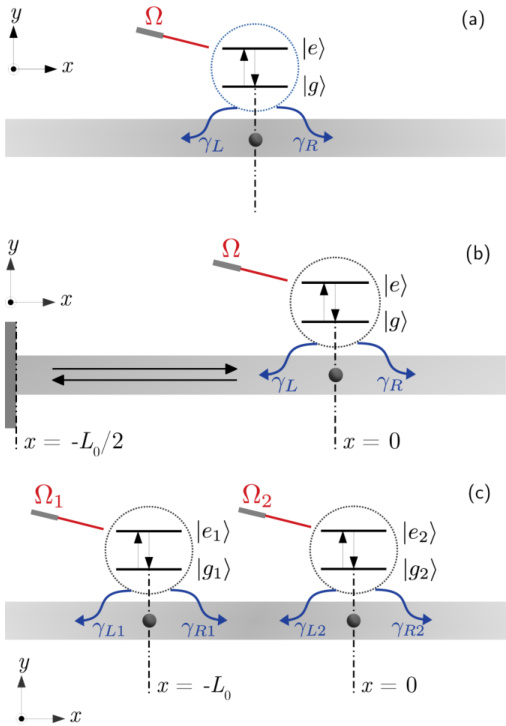{width=40%} FIG. 1. Three systems of interest in waveguide QED, coupling one or two TLS with waveguides with and without a time-delayed coherent feedback and a possible CW pump field. (a) Schematic of a single TLS embedded in an infinite waveguide. We assume the TLS couples asymmetrically to the waveguide, with rates $\gamma_{L}$ and $\gamma_{R}$. (b) Schematic of a single TLS embedded in a terminated waveguide, with a time-delayed coherent feedback from a mirror. The total length of one round trip is $L_{0}$, which causes a delay or memory time of $\tau$. We also consider a CW pump field with a Rabi frequency $\Omega$. (c) Schematic of a two TLS embedded in an infinite waveguide with a finite delay length/time between them. The total delay length is again $L_{0}$, causing a delay time (between quantum emitters) of $\tau$. Both TLSs can be pumped separately.

one dimension [10,47], where the relevant waveguide modes are the ones close to the frequencies of interest. We will see that these continuous waveguide modes have to be discretized, and the basis will be transformed to a time-discrete picture in order to solve the problem efficiently. Next, we introduce the matrix product operators (MPOs) that will be used for solving various problem of interest (Sec. III C). In Sec. III D, MPS theory is applied to evolve our system using the time-evolution operator for each time interval $\Delta t$, and we show how to compute various observables. The advantage of this method lies in the fact that it only needs to be applied in a specific part of the MPS, which reduces the size of the computational space (Hilbert space) and optimizes the efficiency of the calculations [48]. In the last part of this section (Sec. III E), we give a brief description of how the approach is implemented in PYTHON.

 ---------------------------------------------[ 第3页 ]---------------------------------------------  

Next, in Sec. IV, we present an alternative approach to MPSs, which we term the SDW model. This approach extends the recent approach introduced by Whalen [43], and is substantially easier to implement computationally than MPSs. In essence, the SDW model discretizes the waveguide field in the spatial domain over the waveguide length of interest and follows a "collisional" model for the interaction with the quantum optic system of interest [42,45,49,50]. In contrast to MPS theory, the SDW model has a simple and intuitive implementation, without all the added complexities that come with MPSs and tensor networks in general. We first show how to implement the SDW model for an open waveguide and describe the algorithm for evolving the waveguide in this regime. Then, in Sec. IV A, we explain how to derive the interaction Hamiltonian between a general QO system and waveguide in the SDW picture as well as present the interaction Hamiltonians for our three schemes of interest. In Sec. IV B, we extend the current SDW model to include additional Lindblad output channels following the formalism of quantum trajectory (QT) theory and, in Sec. IV C, we discuss the computational implementation of the model.

In Sec. V, results are shown and compared for both models, showing the advantages and disadvantages of each approach. With our selected examples, we show how both models can accurately capture quantum light-matter interaction in waveguide QED, including the role of multiphoton interactions with CW pumping. While the MPS approach does not make any approximation about maximum number of photons in the loop (or the waveguide), the SDW model is explicitly solved to either a one-photon-in-the-loop or two-photons-in-the-loop approximation. This allows us to compare these methods directly to determine when one, two or even more photons need to be treated explicitly at the system level in the waveguide. Even under fairly extreme conditions, such as with very strong pumping fields and long delay lengths for coherent feedback, we find that both models agree extremely well under most situations. The SDW model can also more easily add in additional and realistic dissipation processes, including off-chip decay and pure dephasing; although routinely neglected in most coherent feedback studies to date, we show directly how such background decay processes influence well known feedback control phenomena, such as photon TLS population trapping and entanglement between two spatially separated TLSs. These additional processes are especially important in modeling realistic quantum dots, where pure dephasing and electron-phonon scattering are known to be key processes to understand [35,51–59]. We also show how the SDW waveguide model and QT theory leads to delayed conditioning for single trajectories. Finally, using MPSs, we investigate the entanglement entropy for a two TLS system, and show the role of retardation (delay length). Conclusions and closing discussions are presented in Sec. VI.

# II. SYSTEM HAMILTONIANS

# A. Scheme (i): single two-level system in an infinite waveguide

First, we introduce the Hamiltonian modeling the interaction for one TLS coupled to an infinite waveguide [see

Fig. 1(a)], in the rotating wave approximation:

$$
H = H _ { \mathrm { T L S } } + H _ { \mathrm { p u m p } } + H _ { \mathrm { W } } + H _ { \mathrm { I } } ,
$$

where

$$
H _ { \mathrm { T L S } } = \omega _ { 0 } \sigma ^{+} \sigma ^{-} ,
$$

is the free term for the TLS, with $\omega_{0}$ the resonance energy and $\sigma^{\pm}$ the Pauli operator. The second term,

$$
H _ { \mathrm { p u m p } } = \Omega _ { 0 } ( t ) ( e ^{- i \omega _ { L} t } \sigma ^{+} + e ^{+ i \omega _ { L} t } \sigma ^{-} ) ,
$$

allows for a possible pumping term for the TLS, and $\omega_{\mathrm{L}}$ is the frequency of the laser drive. Natural units are used ($\hbar=1$) throughout our paper, and a CW drive is considered, where $\Omega_{0}(t)=\Omega_{0}$; however, both techniques presented below can easily work with a time-dependent drive. The waveguide term,

$$
H _ { \mathrm { W } } = \sum _ { \alpha = L , R } \int _ { - \infty } ^{\infty} d \omega \omega b _ { \alpha } ^{\dagger} ( \omega ) b _ { \alpha } ( \omega ) ,
$$

is the free term for the waveguide modes (left and right propagating), and

$$
H _ { \mathrm { I } } = \int _ { - \infty } ^{\infty} d \omega [ ( \kappa _ { L } ( \omega ) \sigma ^{+} b _ { L } ( \omega ) + \kappa _ { R } ( \omega ) \sigma ^{+} b _ { R } ( \omega ) ) + \mathrm { H . c } ] ,
$$

describes the TLW-waveguide interaction and H.c. is the Hermitian conjugate. The field operators obey the usual commutation rules for bosons, namely $[b_{i}(\omega), b_{j}^{\dagger}(\omega')] = \delta_{i,j}\delta(\omega - \omega')$.

Transforming to the interaction picture with respect to the TLS- and waveguide-free Hamiltonians, and moving to a rotating frame at the frequency $\omega_{L}=\omega_{0}$, then

$$
\begin{array}{r} { H = \Omega _ { 0 } ( \sigma ^{+} + \sigma ^{-} ) + \int _ { - \infty } ^{\infty} d \omega \big [ ( \kappa _ { L } ( \omega ) \sigma ^{+} b _ { L } ( \omega ) } \\{ + \kappa _ { R } ( \omega ) \sigma ^{+} b _ { R } ( \omega ) ) e ^{- i ( \omega - \omega _ { 0} ) t } + \mathrm { H . c . } \big ] . } \end{array}
$$

Next, we define the time-dependent operators

$$
b _ { \omega } ( t ) = \frac { 1 } { \sqrt { 2 \pi } } \int _ { - \infty } ^{\infty} d \omega b _ { \alpha } ( \omega ) e ^{- i ( \omega - \omega _ { 0} ) t }
$$

and the TLS-waveguide decay rate

$$
\gamma _ { \alpha } = 2 \pi \kappa _ { \alpha } ^{2} ( \omega _ { 0 } ) ,
$$

where $\alpha = L, R,$ and $\kappa_{\alpha}$ is assumed to be frequency independent as most of the coupling is close to TLS frequency; thus we have replaced $\kappa_{\alpha}(\omega)$ by $\kappa_{\alpha}(\omega_0) = \sqrt{\gamma_u/2\pi}$. The time-dependent field operators satisfy: $[b_i(t), b_j^\dagger(t')] = \delta_{i,j}\delta(t - t')$. Subsequently, the interaction Hamiltonian can be written as

$$
\begin{array}{r} { H _ { 1 } = \sqrt { \gamma _ { L } } ( \sigma ^{+} b _ { L } ( t ) + \sigma ^{-} b _ { L } ^{\dagger} ( t ) ) } \\{ + \sqrt { \gamma _ { R } } ( \sigma ^{+} b _ { R } ( t ) + \sigma ^{-} b _ { R } ^{\dagger} ( t ) . } \end{array}
$$

In the case where there is equal coupling rates to both sides of the waveguide, $\gamma_{L}=\gamma_{R}=\gamma/2$, then one can introduce a single collective operator for the two waveguide modes, $b(\omega)$, so that

$$
b ( t ) = \frac { 1 } { \sqrt { 2 \pi } } \int _ { - \infty } ^{\infty} d \omega b ( \omega ) e ^{- i ( \omega - \omega _ { 0} ) t } ,
$$

 ---------------------------------------------[ 第4页 ]---------------------------------------------  

and the total TLS-waveguide decay rate is $\gamma=2\pi\kappa^{2}(\omega_{0})$. Thus, with symmetric coupling, the Hamiltonian is now

$$
H = \Omega _ { 0 } ( \sigma ^{+} + \sigma ^{-} ) + \sqrt { \gamma } ( \sigma ^{+} b ( t ) + \sigma ^{-} b ^{\dagger} ( t ) ) .
$$

Symmetry breaking, for example, can be achieved in photonic crystal waveguides, using spin charged quantum dots coupled to points of circular polarization [60–63], which can give rise to a number of interest effects in chiral waveguide QED [64]. Indeed, chiral field interactions can be found in many photonic waveguide and resonator systems [65–69].

# B. Scheme (ii): single two-level system in a half open waveguide with a time-delayed coherent feedback

For our second waveguide system, we present the Hamiltonian for modeling the interaction of one TLS in a semi-infinite (half open) waveguide [see Fig. 1(b)], that is, when a mirror and coherent feedback is present. The Hamiltonian is again composed of a single TLS and a pumping term as in Eq. (1), where $H_{\mathrm{TLS}}$ and $H_{\mathrm{pump}}$ follow Eqs. (2) and (3), respectively. The free term for the waveguide modes is now

$$
H _ { \mathrm { W } } = \int _ { - \infty } ^{\infty} d \omega \omega b ^{\dagger} ( \omega ) b ( \omega ) ,
$$

which consists of a linear combination of modes that propagate to the left and to the right. Note that $b(\omega)$ here should not be confused with the field operator we introduced in scheme (i) in the case of symmetric coupling; rather it is a generic field operator for the complete waveguide system.

Since the waveguide bath is modified by the feedback loop, the interaction Hamiltonian takes the form:

$$
H _ { 1 } = \int d \omega [ G _ { \mathrm { f b a c k } } ( \omega ) b ( \omega ) \sigma ^{+} + \mathrm { H . c . } ] ,
$$

which describes the interaction between the TLS and the mirror-modified reservoir, and $G_{\mathrm{fback}}(\omega)$ accounts for the boundary condition of the terminated side of the waveguide. The bath coupling term $G_{\mathrm{fback}}$ can in principle be solved formally using scattering theory, e.g., using photon Green functions derived for a particular waveguide-cavity system [70]. Here we will adopt a simple model to account for feedback from a perfect mirror (no losses):

$$
G _ { \mathrm { f i b a c k } } ( \omega ) = \frac { 1 } { \sqrt { 2 \pi } } \Bigl ( \sqrt { \gamma _ { L } } e ^{i ( \omega \tau - \phi _ { \mathrm { M} } ) / 2 } + \sqrt { \gamma _ { R } } e ^{- i ( \omega \tau - \phi _ { \mathrm { M} } ) / 2 } \Bigr ) ,
$$

where $\phi_{\mathrm{M}}$ is the mirror phase. Note that a factor of 2 appears in the phase term as we define $\tau$ as the total round-trip time from the TLS to the mirror and back. In the interaction picture,

$$
\begin{array}{rl} & { H _ { \mathrm { I } } = \int d \omega \big [ G _ { \mathrm { f b a c k } } ( \omega ) e ^{- i ( \omega - \omega _ { 0} ) t } b ( \omega ) \sigma ^{+} + \mathrm { H . c . } \big ] } \\& {  = \int d \omega \big [ 1 / \sqrt { 2 \pi } \Big ( \sqrt { \gamma _ { L } } e ^{i ( \omega \tau - \phi _ { \mathrm { M} } ) / 2 } + \sqrt { \gamma _ { R } } e ^{- i ( \omega \tau - \phi _ { \mathrm { M} } ) / 2 } \Big ) } \\& {  \times \, e ^{- i ( \omega - \omega _ { 0} ) t } b ( \omega ) \sigma ^{+} + \mathrm { H . c . } \big ] . } \end{array}
$$

Next, we can define

$$
\begin{array}{r} { b ( t - \tau / 2 ) = \frac { 1 } { \sqrt { 2 \pi } } \int d \omega b ( \omega ) e ^{- i ( \omega - \omega _ { 0} ) ( t - \tau / 2 ) } } \\{ = \frac { 1 } { \sqrt { 2 \pi } } \int d \omega b ( \omega ) e ^{- i ( \omega t - \omega \tau / 2 - \omega _ { 0} t - \omega _ { 0 } \tau / 2 ) } } \end{array}
$$

and

$$
\begin{array}{r} { b ( t + \tau / 2 ) = \frac { 1 } { \sqrt { 2 \pi } } \int d \omega b ( \omega ) e ^{- i ( \omega - \omega _ { 0} ) ( t + \tau / 2 ) } } \\{ = \frac { 1 } { \sqrt { 2 \pi } } \int d \omega b ( \omega ) e ^{- i ( \omega t + \omega \tau / 2 - \omega _ { 0} t - \omega _ { 0 } \tau / 2 ) } , } \end{array}
$$

to obtain

$$
\begin{array}{r} { H _ { 1 } = ( \sqrt { \gamma _ { L } } e ^{- i \phi / 2} b ( t - \tau / 2 ) } \\{ + \sqrt { \gamma _ { R } } e ^{i \phi / 2} b ( t + \tau / 2 ) ) \sigma ^{+} + \mathrm { H . c . } , } \end{array}
$$

where $\phi = \phi_{\mathrm{M}} - \omega_{0} \tau$. Finally, redefining

$$
b ( t + \tau / 2 ) e ^{i \phi / 2} \rightarrow b ( t ) ,
$$

$$
b ( t - \tau / 2 ) e ^{i \phi / 2} \rightarrow b ( t - \tau ) ,
$$

we obtain

$$
H _ { \mathrm { l } } = ( \sqrt { \gamma _ { L } } e ^{- i \phi} b ( t - \tau ) + \sqrt { \gamma _ { R } } b ( t ) ) \sigma ^{+} + \mathrm { H . c . } ,
$$

consistent with the form of Pichler and Zoller [71]. It is clear that the $\tau$ dependence of $b(t-\tau)$ includes the effects of retardation (memory), and this term makes the problem non-Markovian, in contrast to the case without feedback. In this work, we refer to the non-Markovian case as a problem where the usual time-local Lindblad master equations fail and memory effects must be taken in consideration, following the terminology used in previous papers [10,20]. This is precisely why we must treat the circulating waveguide photons at the system level, since the usual Markov approximations would fail.

Commonly, symmetrical coupling rates are assumed for this feedback setup with $\gamma_{L}=\gamma_{R}=\gamma/2$. This changes the form of $G_{\mathrm{back}}$ in the interaction picture to

$$
G _ { \mathrm { f b a c k } } ( \omega ) = \sqrt { 2 } \sqrt { \frac { \gamma } { 2 \pi } } \sin \left( \frac { \omega \tau + \phi ^{\prime} } { 2 } \right) ,
$$

with $\phi'=\omega_0\tau+\pi-\phi_{\mathrm{M}}$. Note that this differs slightly from other common bath functions in this form [15,16] because we have defined $\gamma$ as the full decay rate (i.e., a population decay rate) to the waveguide rather than the half rate and here $\phi'$ explicitly contains the phase introduced from the mirror.

# C. Scheme (iii): two coupled two-levels systems separated with some finite distance and time delay

Lastly, two spatially separated TLSs in an infinite waveguide are considered [see Fig. 1(c)]. The Hamiltonian is

$$
H = \sum _ { n = 1 , 2 } \left( H _ { \mathrm { T L S } } ^{( n )} + H _ { \mathrm { p u m p } } ^{( n )} \right) + H _ { \mathrm { W } } + H _ { 1 } ,
$$

where the TLS free terms are now

$$
H _ { \mathrm { T L S } } ^{( n = 1 , 2 )} = \omega _ { n } \sigma _ { n } ^{+} \sigma _ { n } ^{-} ,
$$

 ---------------------------------------------[ 第5页 ]---------------------------------------------  

and the pump terms are

$$
H _ { \mathrm { p u m p } } ^{( n = 1 , 2 )} = \frac { 1 } { 2 } [ \Omega _ { n } \sigma _ { n } ^{-} e ^{i \omega _ { \perp} t } + \mathrm { H . c . } ] ,
$$

where $\Omega_{n}$ is the Rabi frequency of a driving field (at TLS $n$), $\omega_{n}$ is the transition frequency of each TLS, and $\sigma_{n}^{+}$, $\sigma_{n}^{-}$ are the Pauli operators for each TLS.

Since the two TLS case results in symmetry breaking (namely, with the finite retardation phase effects), the waveguide Hamiltonian must now be separated into left and right going channels,

$$
H _ { \mathrm { W } } = \sum _ { \alpha = L , R } \int _ { - \infty } ^{\infty} d \omega \omega b _ { \alpha } ^{\dagger} ( \omega ) b _ { \alpha } ( \omega ) ,
$$

and the interaction Hamiltonian is

$$
\begin{array}{rl} & { H _ { 1 } = \frac { 1 } { \sqrt { 2 \pi } } \int _ { - \infty } ^{\infty} d \omega \bigl \{ ( \sqrt { \gamma _ { L 1 } } e ^{i \omega x _ { 1} / c } ~ b _ { L } ( \omega ) \sigma _ { 1 } ^{+} } \\& {  + \sqrt { \gamma _ { R 1 } } e ^{- i \omega x _ { 1} / c } b _ { R } ( \omega ) \sigma _ { 1 } ^{+} \bigr \} + \mathrm { H . c . } } \\& {  + \left( \sqrt { \gamma _ { L 2 } } e ^{i \omega x _ { 2} / c } b _ { L } ( \omega ) \sigma _ { 2 } ^{+} \right. } \\& {  \left. + \sqrt { \gamma _ { R 2 } } e ^{- i \omega x _ { 2} / c } b _ { R } ( \omega ) \sigma _ { 2 } ^{+} \right) + \mathrm { H . c . } \biggr \} , } \end{array}
$$

where $x_{n}$ with $n=1$, 2 is the position of each TLS.

In the interaction picture, again at the frequency of $\omega_{\mathrm{L}}=\omega_{0}$, we have

$$
\begin{array}{r} { H _ { 1 } = \frac { 1 } { \sqrt { 2 \pi } } \int _ { - \infty } ^{\infty} d \omega \bigl \{ ( \sqrt { \gamma _ { L 1 } } e ^{i \omega x _ { 1 / c} } b _ { L } ( \omega ) \sigma _ { 1 } ^{+} } \\{ + \sqrt { \gamma _ { R 1 } } e ^{- i \omega x _ { 1 / c} } b _ { R } ( \omega ) \sigma _ { 1 } ^{+} \bigr \} e ^{- i ( \omega - \omega _ { 0} ) t } + \mathrm { H . c . } } \\{ + \left( \sqrt { \gamma _ { L 2 } } e ^{i \omega x _ { 2 / c} } b _ { L } ( \omega ) \sigma _ { 2 } ^{+} \right. } \\{ \left. + \sqrt { \gamma _ { R 2 } } e ^{- i \omega x _ { 2 / c} } b _ { R } ( \omega ) \sigma _ { 2 } ^{+} \right) e ^{- i ( \omega - \omega _ { 0} ) t } + \mathrm { H . c . } \right\} . } \end{array}
$$

Defining the operators

$$
\begin{array}{r} { b _ { L } ( t - x _ { n } / c ) = \frac { 1 } { \sqrt { 2 \pi } } \int d \omega \, b _ { L } ( \omega ) e ^{- i ( \omega - \omega _ { 0} ) ( t - x _ { n } / c ) } } \\{ = \frac { 1 } { \sqrt { 2 \pi } } \int d \omega \, b _ { L } ( \omega ) e ^{- i ( \omega t - \omega x _ { n} / c - \omega _ { 0 } t + \omega _ { 0 } x _ { n } / c ) } , } \end{array}
$$

$$
\begin{array}{r} { b _ { R } ( t + x _ { n } / c ) = \frac { 1 } { \sqrt { 2 \pi } } \int d \omega b _ { R } ( \omega ) e ^{- i ( \omega - \omega _ { 0} ) ( t + x _ { n } / c ) } } \\{ = \frac { 1 } { \sqrt { 2 \pi } } \int d \omega b _ { R } ( \omega ) e ^{- i ( \omega t + \omega x _ { n} / c - \omega _ { 0 } t - \omega _ { 0 } x _ { n } / c ) } , } \end{array}
$$

then we obtain

$$
\begin{array}{rl} & { H _ { 1 } = ( \sqrt { \gamma _ { L 1 } } e ^{- i \omega _ { 0} x _ { 1 / c } } b _ { L } ( t - x _ { 1 } / c ) \sigma _ { 1 } ^{+} } \\& {  + \sqrt { \gamma _ { R 1 } } e ^{i \omega _ { 0} x _ { 1 / c } } \, b _ { R } ( t + x _ { 1 } / c ) \sigma _ { 1 } ^{+} ) + \mathrm { H . c . } } \\& {  + \, ( \sqrt { \gamma _ { L 2 } } e ^{- i \omega _ { 0} x _ { 2 / c } } \, b _ { L } ( t - x _ { 2 } / c ) \sigma _ { 2 } ^{+} } \\& {  + \, \sqrt { \gamma _ { R 2 } } e ^{i \omega _ { 0} x _ { 2 / c } } \, b _ { R } ( t + x _ { 2 } / c ) \sigma _ { 2 } ^{+} ) + \mathrm { H . c . } . } \end{array}
$$

Next, we redefine the following terms:

$$
\begin{array}{r} { b _ { R } ( t + x _ { 2 } / c ) e ^{i \omega _ { 0} x _ { 2 } / c } \to b _ { R } ( t ) , } \\{ b _ { R } ( t + x _ { 1 } / c ) e ^{i \omega _ { 0} x _ { 2 } / c } \to b _ { R } ( t + x _ { 1 } / c - x _ { 2 } / c ) = b _ { R } ( t - \tau ) , } \\{ b _ { L } ( t - x _ { 1 } / c ) e ^{- i \omega _ { 0} x _ { 1 } / c } \to b _ { L } ( t ) , } \\{ b _ { L } ( t - x _ { 2 } / c ) e ^{- i \omega _ { 0} x _ { 1 } / c } \to b _ { L } ( t + x _ { 1 } / c - x _ { 2 } / c ) = b _ { L } ( t - \tau ) , } \end{array}
$$

where $\tau=(x_{2}-x_{1})/c$. The interaction Hamiltonian, in the time domain, is now

$$
\begin{array}{r} { H _ { 1 } = ( \sqrt { \gamma _ { L 1 } } \, b _ { L } ( t ) + \sqrt { \gamma _ { R 1 } } e ^{- i \omega _ { 0} \tau } \, b _ { R } ( t - \tau ) ) \sigma _ { 1 } ^{+} + \mathrm { H . c . } } \\{ + ( \sqrt { \gamma _ { L 2 } } e ^{- i \omega _ { 0} \tau } \, b _ { L } ( t - \tau ) + \sqrt { \gamma _ { R 2 } } \, b _ { R } ( t ) ) \sigma _ { 2 } ^{+} + \mathrm { H . c . } } \end{array}
$$

Finally, by defining the phase $\phi = -\omega_0 \tau$, we obtain the desired interaction Hamiltonian:

$$
\begin{array}{r} { H _ { 1 } = ( \sqrt { \gamma _ { L 1 } } b _ { L } ( t ) + \sqrt { \gamma _ { R 1 } } e ^{i \phi} b _ { R } ( t - \tau ) ) \sigma _ { 1 } ^{+} + \mathrm { H . c . } } \\{ + ( \sqrt { \gamma _ { L 2 } } e ^{i \phi} b _ { L } ( t - \tau ) + \sqrt { \gamma _ { R 2 } } \, b _ { R } ( t ) ) \sigma _ { 2 } ^{+} + \mathrm { H . c . } } \end{array}
$$

Note that in the limit of only one TLS, we recover the $H_{\mathrm{I}}$ result of Eq. (9).

# III. MATRIX PRODUCT STATES

# A. Quantum states, diagrammatic representation, and canonical form of matrix product states

A quantum state for many-body problems can quickly have an impractically large Hilbert space, e.g., for a system of $N$ spins with spin 1/2, the dimension of the Hilbert space is $2^N$. The MPS method takes advantage of the significance of some quantum states compared to others; this can be shown in the entanglement between the states composing the system [47]. As the Hamiltonian evolves the system in time, these states will become entangled. Furthermore, by choosing the significant entangled states appropriately, the total Hilbert space will be restricted to a smaller and more efficient subspace [40,72].

The quantum state for a 1D spin chain, with $N$ spins, is given by [73]

$$
| \psi \rangle = \sum _ { i _ { 1 } , . . . , i _ { N } } ^{d} c _ { i _ { 1 } , . . . , i _ { N } } | i _ { 1 } , . . . , i _ { N } \rangle \, ,
$$

where $i_{k}$ (with $k \in \{1, \ldots, N\}$) represents each state with a dimension of $d$, and $c_{i}$ are the coefficients of the corresponding state.

The MPS algorithm relies on the Schmidt decomposition of a quantum system, which considers the bipartition state of the system as a tensor product [73]. In practice, the state can be transformed using the singular-value decomposition (SVD) or Schmidt decomposition. The SVD theorem states

 ---------------------------------------------[ 第6页 ]---------------------------------------------  

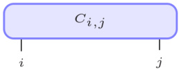{width=20%} FIG. 2. Diagrammatic representation of a matrix $(C_{i,j})$ with physical indices (physical dimensions of system) $i$ and $j$.

that any matrix can be factorized, decomposing it into three new matrices [46,73]. The SVD decomposition of a matrix $M$ of dimension $N_A \times N_B$ is [74],

$$
M = U S V ^{\dagger} ,
$$

where $S$ is a diagonal matrix containing the Schmidt coefficients in descendent order (i.e., largest to smallest), $U$ is left-normalized and $V$ is right-normalized [74]. Then, one of the side matrices can be multiplied by the one containing the Schmidt coefficients, which receives the name of "Orthogonality center" (OC) [47], and we end up with two new matrices.

Assuming a system can be divided into two subsystems $A$ and $B$, then

$$
| \psi \rangle = \sum _ { i j } C _ { i , j } \, | i \rangle _ { A } \, | j \rangle _ { B } \, ,
$$

where $|i\rangle_{A}$ and $|j\rangle_{B}$ form the new orthogonal basis, $C_{i,j}$ describes the matrix containing the $c_{i}$ defined in Eq. (35), and $i$ and $j$ contain several indices. In the case of a TLS in a waveguide, the first basis would correspond to the TLS with just one state, and the second one would correspond the rest of the states for the waveguide describing the number of photons. Furthermore, for two TLSs we will have one basis where both TLSs are included and a second one including the waveguide. In general, a system can be divided in different subsystems. If some parts of the entire system can be written in terms of the same basis, they can belong to the same subsystem (e.g., the two TLSs); if not, they will form a different subsystem (e.g., the waveguide).

The diagrammatic representation is normally used in tensor networks, and in MPS for this specific case, to better visualize a simple representation of the operations performed on a state [47,48,75]. It is a powerful tool that helps to represent the algorithm used in each problem, and makes it easier to follow complex operations as contractions between various tensors.

For example, an arbitrary matrix can be represented as shown in Fig. 2. Another simple example is to represent Eq. (36) in its diagrammatic form, where we obtain the scheme shown in Fig. 3.

The indices are divided in "physical indices," which correspond to the physical dimensions of our system and are

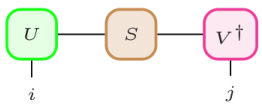{width=21%} FIG. 3. Diagrammatic representation of the SVD of a matrix, where $U$ is a left normalized matrix. $S$ is the Schmidt coefficients and $V^\dagger$ is a right normalized matrix [see Eq. (36)].

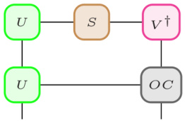{width=21%} FIG. 4. Diagrammatic representation of a right contraction after a SVD of a matrix; $U$ is a left normalized matrix, $S$ is the diagonal with the Schmidt coefficients, $V^\dagger$ is a right normalized matrix, and $OC$ is the orthogonality center.

represented as open vertical links, and the bond or virtual indices related to the decomposition of the MPS, are represented as horizontal links between tensors and will store the entanglement information. The number of indices of a tensor defines its rank, for example, a vector will have one index and a matrix will have two.

Decomposing $C_{ij}$ through a SVD, and taking into account that $U$ and $V^\dagger$ are orthonormal, the total state can be written as

$$
| \psi \rangle = \sum _ { \alpha = 1 } ^{\operatorname* { m i n} ( N _ { A } , N _ { B } ) } s _ { \alpha } \, | \alpha \rangle _ { A } \, | \alpha \rangle _ { B } \ ,
$$

where we have introduced a new basis and $s_{\alpha}$ are the elements of the diagonal matrix, and the substates are

$$
| \alpha \rangle _ { A } = \sum _ { i } U _ { i \alpha } \, | i \rangle _ { A } \, ,  | \alpha \rangle _ { B } = \sum _ { j } V _ { j \alpha } ^{\dagger} \, | j \rangle _ { B } \, .
$$

The Schmidt rank, which we label with $r$, is defined as the number of non negligible values for the Schmidt coefficients, hence, $r \leqslant \min(N_A, N_B)$. Performing a SVD, we can truncate the matrix for values greater than the rank and thus reduce the number of columns of $U$ and the rows of $V^\dagger$. Now, when the entanglement between the states is small, many values of $s_\alpha$ tend to zero and this approximation is excellent and considerably reduces the dimensions of the system.

The entanglement can be quantified by the von Neumann entropy [76],

$$
S _ { A | B } = - \sum _ { \alpha = 1 } ^{r} s _ { \alpha } ^{2} \ln ~ s _ { \alpha } ^{2} .
$$

However, in practice, one can simply limit the number of Schmidt coefficients considered and check that the number is sufficient for numerical convergence.

After several SVDs, the general expression for a MPS follows [72],

$$
| \psi \rangle = \sum _ { i _ { 1 } \ldots i _ { N } } A _ { a _ { 1 } } ^{i _ { 1} } A _ { a _ { 1 } , a _ { 2 } } ^{i _ { 2} } \ldots A _ { a _ { N - 2 } , a _ { N - 1 } } ^{i _ { N - 1} } A _ { a _ { N - 1 } } ^{i _ { N} } | i _ { 1 } , \ldots , i _ { N } \rangle \, ,
$$

where each term is a tensor, and $a_{1},\ldots,a_{N-1}$ are the "bond" lengths or auxiliary dimensions of each element and $i_{1},\ldots,i_{N}$ represent the physical dimensions of the system. Here, in the bonds dimensions, is where we approximate our system. By limiting this value, we limit the number of values of the Schmidt coefficient considered. This will make the method

 ---------------------------------------------[ 第7页 ]---------------------------------------------  

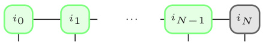{width=35%} FIG. 5. Diagrammatic representation of a left-canonical MPS, where the OC is situated at the right of the system (black) and the rest of the bins are left normalized (green).

more efficient, while keeping a high precision for the numerical results.

As an example, in the case of a TLS in a waveguide, after a first SVD, Eq. (37) will follow, where on one side we have the TLS and on the other the entire waveguide. Thus, for getting every site separated, we have to continue applying the SVD to the waveguide part until we decompose it in $N$ sites, obtaining the following form:

$$
| \psi \rangle = \sum _ { i , i _ { 1 } \ldots i _ { N } } A _ { a _ { 1 } } ^{i _ { i} } A _ { a _ { 1 } , a _ { 2 } } ^{i _ { 1} } \cdots A _ { a _ { N - 1 } , a _ { N } } ^{i _ { N - 1} } A _ { a _ { N } } ^{i _ { N} } | i _ { s } , i _ { 1 } , \ldots , i _ { N } \rangle \, ,
$$

where the first term represents the TLS, and the remaining $N$ terms represent the discretized waveguide, representing the possibility of at least $N$ photons in the waveguide. In addition, this $N$ can become arbitrarily large as the waveguide can be divided in as many time bins as needed.

There is no single (unique) way of performing the number of SVDs required, as the system is divided in two subsystems each time a SVD is done [46]. One way is to start from the left and take $i_0$ as the first subsystem and $i_1,\ldots,i_N$ as the second one. This process is repeated from the left to the right until the orthonormal matrix is on right side (OC). This method is called a left-canonical MPS (Fig. 5) [77]. On the other hand, a right-canonical MPS will be the one made in the opposite direction, with the OC at the left (Fig. 6). Finally, in a mixed-canonical MPS, the OC is situated in an arbitrary position (see Fig. 7). The mixed-canonical case will be the one used in the systems studied below, as the OC will be moving in the system to keep track of the observables. This will be explained in more detail in Sec. III D.

# B. Hamiltonian of the systems in the picture of matrix product states

We consider a waveguide that is coupled to the TLSs (one or two), and here we will treat these systems as a many-body system which will be solved using the MPS formalism.

To write the Hamiltonians in terms of the MPS formalism, the frequency-dependent creation and annihilation operators for the waveguide can be transformed to the time domain as follows:

$$
b _ { \alpha } ( t ) = \frac { 1 } { \sqrt { 2 \pi } } \int d \omega b _ { \alpha } ( \omega ) e ^{- i ( \omega - \omega _ { 0} ) t } ,
$$

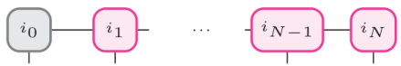{width=35%} FIG. 6. Diagrammatic representation of a right-canonical MPS, where the OC is situated at the left of the system (black) and the rest of the bins are right normalized (magenta).

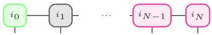{width=35%} FIG. 7. Diagrammatic representation of a mixed-canonical MPS, where the OC is situated at an arbitrary position in the system (black), the bins on its right are right normalized (magenta) and the ones on its left are left normalized (green).

and are defined in terms of the time-bin noise operators:

$$
\Delta B _ { \alpha } ( t _ { k } ) = \int _ { t _ { k } } ^{t _ { k + 1} } d t ^{\prime} b _ { \alpha } ( t ^{\prime} ) ,
$$

$$
\Delta B _ { \alpha } ^{\dagger} ( t _ { k } ) = \int _ { t _ { k } } ^{t _ { k + 1} } d t ^{\prime} b _ { \alpha } ^{\dagger} ( t ^{\prime} ) .
$$

These time-bin noise operators form a time-discrete and orthogonal basis which is normalized with the commutator proportional to $\Delta t$,

$$
[ \Delta B _ { \alpha } ( t _ { k } ) , \, \Delta B _ { \alpha ^{\prime} } ^{\dagger} ( t _ { k ^{\prime} } ) ] = \Delta t \delta _ { k , k ^{\prime} } \delta _ { \alpha , \alpha ^{\prime} } .
$$

Consequently, a time-discrete number basis is created as follows:

$$
\left| I _ { k } ^{\nu} \right\rangle = \frac { ( \Delta B _ { \alpha } ^{\dagger} ( t _ { k } ) ) _ { T _ { k } } ^{\nu} } { \sqrt { I _ { k } ^{\alpha} ! ( \Delta t ) _ { T _ { k } } ^{\nu} } } \left| \mathrm { v a c } \right\rangle ,
$$

where $\sqrt{(\Delta t)^{\frac{a}{k}}}$ appears in the denominator for normalization. The state $|t_{k}^{\sigma}\rangle$ is referred to as the "time bin" and represents the number of photons created in the waveguide at time interval $\Delta t$. Subsequently, we can write $|\psi\rangle$ in the time-discrete basis and operate on it with the time-evolution operator.

Note in the above treatment, the spatial dependency of the photons is absorbed. Hence, it is hidden in the model and there is no explicit information about the position of each photon in the waveguide.

# 1. Scheme (i): single two-level system in an infinite waveguide

The Hamiltonian modeling this system is described in Sec. II A. The expression of the time-evolution operator, for a time step in terms of the noise operators, is

$$
U ( t _ { k + 1 } , t _ { k } ) = \exp \left( - i \int _ { t _ { k } } ^{t _ { k + 1} } d t ^{\prime} H ( t ^{\prime} ) \right) .
$$

For the general case when the TLS decay rates are different and considering the right and left moving photons separately, then we have

$$
\begin{array}{r} { U ( t _ { k + 1 } , t _ { k } ) = \exp \Big [ - i \Omega _ { 0 } \Delta t ( \sigma ^{+} + \sigma ^{-} ) } \\{ - i \sqrt { \gamma _ { L } } \big ( \sigma ^{+} \Delta B _ { L } ( t _ { k } ) + \sigma ^{-} \Delta B _ { L } ^{( \dagger )} ( t _ { k } ) \big ) } \\{ - i \sqrt { \gamma _ { R } } \big ( \sigma ^{+} \Delta B _ { R } ( t _ { k } ) + \sigma ^{-} \Delta B _ { R } ^{( \dagger )} ( t _ { k } ) \big ) \Big ] } \end{array}
$$

If we consider equal (symmetric) coupling and one waveguide mode, we can write this as

$$
\begin{array}{r} { U ( t _ { k + 1 } , t _ { k } ) = \exp \left[ - i \Omega _ { 0 } \Delta t ( \sigma ^{+} + \sigma ^{-} ) \right. } \\{ \left. - i \sqrt { \gamma } \left( \sigma ^{+} \Delta B ( t _ { k } ) + \sigma ^{-} \Delta B ^{( \dagger )} ( t _ { k } ) \right) \right] , } \end{array}
$$

and the noise operators represent the creation or annihilation of a photon in a time interval $\Delta t$ (time bin).

 ---------------------------------------------[ 第8页 ]---------------------------------------------  

# 2. Scheme (ii): single two-level system in a half open waveguide with a time-delayed coherent feedback

Starting from the equations shown in Sec. II B, the complete Hamiltonian is transformed into a rotating frame with respect to the free evolution of the system and the waveguide reservoir. Following the same procedure as above, the time-evolution operator, written in terms of the noise operators, is

$$
\begin{array}{rl} & { U ( t _ { k + 1 } , t _ { k } ) } \\& {  = \exp [ \{ - i \Delta t \Omega _ { 0 } ( \sigma ^{+} + \sigma ^{-} ) } \\& {  - i ( \sqrt { \gamma _ { L } } \Delta B ( t _ { k - 1 } ) e ^{- i \phi} + \sqrt { \gamma _ { K } } \Delta B ( t _ { k } ) ) \sigma ^{+} + \mathrm { H . c . } ] , } \end{array}
$$

where $t_{k}=k\,\Delta t$ and $t_{k-l}=t_{k}-\tau$.

Considering symmetric coupling, $\gamma_{L}=\gamma_{R}=\gamma/2$, then

$$
\begin{array}{rl} & { U ( t _ { k + 1 } , t _ { k } ) } \\& {  = \exp \left\{ \Big [ - i \Delta t \Omega _ { 0 } ( \sigma ^{+} + \sigma ^{-} ) \right. } \\& {  \left. - i \bigg ( \sqrt { \frac { \gamma } { 2 } } \Delta B ( t _ { k - l } ) e ^{- i \phi} + \sqrt { \frac { \gamma } { 2 } } \Delta B ( t _ { k } ) \bigg ) \sigma ^{+} + \mathrm { H . c . } \bigg ] \right\} . } \end{array}
$$

As expected, we see that this system is intrinsically non-Markovian through the time delay $\tau = t_k - t_{k-l}$, which has a memory of the past quantum dynamics that are introduced through feedback.

# 3. Scheme (iii): two two-level separation with some finite time delay

In the third waveguide QED system of interest (see Sec. II C), the time-evolution operator is also obtained from the discretization of the time bins; using the quantum noise operators already defined in Eqs. (44) and (45), we obtain

$$
\begin{array}{rl} & { U ( t _ { k + 1 } , t _ { k } ) = \exp \left\{ - i \Delta t \Omega _ { 0 } ( \sigma _ { 1 } ^{+} + \sigma _ { 1 } ^{-} ) - i \Delta t \Omega _ { 0 } ( \sigma _ { 2 } ^{+} + \sigma _ { 2 } ^{-} ) \right. } \\& {                                                                                                                                                                                                                                                                                                                                                                                                                                                                                                                                                                                                                                                                                                                                                                                                                                                                                                                                                                                                                                                                                                                                                                                                                                                                                                                                                                               \q
$$

where $l=\tau/\Delta t$, which now represents the number of sites (time bins) between the two TLSs.

# C. Matrix product operators

The time evolution is computed through the time operator $U$. This operator can be seen as a projector which projects one physical index $i$ to another $j$ with some coefficients $U^{ji}$. For example, a MPO operating on two sites, 1 and 2, can be written as follows (see Fig. 8):

$$
O = \sum _ { j , i } O ^{j _ { 1} , i _ { 1 } } O ^{j _ { 2} , i _ { 2 } } \left| j \right\rangle \left\langle i \right| ,
$$

where $j = j_1$, $j_2$ and $i = i_1$, $i_2$ are the labels for the physical indices of the corresponding bra and ket.

The MPOs have two physical indices per site. The main advantage is that the whole state does not need to be computed when an operator is applied, since it will only affect the corresponding sites [76,78].

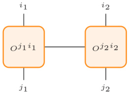{width=21%} FIG. 8. Diagrammatic representation of $\hat{O}$ as a MPO acting on two sites with physical indices $i_{1}$, $j_{1}$ and $i_{2}$, $j_{2}$.

We can construct the time-evolution operator as a local operator operating on two sites in the no feedback case (the TLS bin and the corresponding time bin), and on three sites when the feedback is included (the TLS bin, time bin and feedback bin) or when the system is made of two TLS (see Sec. III B for more details).

The quantum noise operators involved in the time evolution are represented as one site operators, defined through

$$
\Delta B _ { \alpha } = \left[ \begin{array}{l} { 0 \; \sqrt { \Delta t } } \\{ 0 \; 0 } \end{array} \right] , \; \; \Delta B _ { \alpha } ^{\dagger} = \left[ \begin{array}{l} { 0 \; 0 } \\{ \sqrt { \Delta t } \; 0 } \end{array} \right] ,
$$

with $\alpha=L,R$. Here we truncate the Hilbert space for each time bin to one excited photon state; this of course can be generalized, e.g., if we allowed up to two photon states per time bin, then we would have a $3 \times 3$ matrix representation for the quantum noise operators.

On the other hand, the expectation of the TLS atom population operator will be a single site MPO ($n_{a}$), operating on the TLS bin:

$$
n _ { a , n } = \langle \psi | \, \sigma _ { n } ^{+} \sigma _ { n } ^{-} \, | \psi \rangle \; ,
$$

where $\sigma_{n}^{+}$ $\sigma_{n}^{-}$ are defined as

$$
\sigma _ { n } ^{+} = \left[ \begin{array}{l} { 0 } \\{ 1 } \end{array} \right] ,  \sigma _ { n } ^{-} = \left[ \begin{array}{l} { 0 } \\{ 1 } \end{array} \right] .
$$

Finally, a swap operator will be applied to switch the position of two bins in the chain. Therefore it will be a two-site MPO operating on the sites involved. This MPO will depend on the dimensions of the sites to be swapped. In order to have the same dimensions in every bin and be able to use this operator, we limit the number of photons per time bin to one. This approximation is very accurate as the time steps considered are small.

The swap operator can be defined as [79]

$$
V _ { \mathrm { s w a p } } = \sum _ { j , k } | j k \rangle \, \langle k j | \, ,
$$

where $j$ and $k$ can be made of one or more subsystems. For example, in the case of swapping the TLS bin and one time bin for one TLS, we can have

$$
V _ { \mathrm { s w a p } } ^{i , i _ { t} } = \sum _ { i _ { t } , i _ { j } } | i _ { t } i _ { s } \rangle \; \langle i _ { s } i _ { t } | \ ,
$$

with $i_{s}$ corresponding to the TLS bin and $i_{t}$ a time bin. In this case, both bins have dimension of 2, $i_{t} \otimes i_{s}$ will have dimension of 4 and the operator then will be a matrix $4 \times 4$.

 ---------------------------------------------[ 第9页 ]---------------------------------------------  

This can be also applied when swapping a time bin with the feedback bin,

$$
\mathrm { V } _ { \mathrm { s w a p } } ^{i _ { t} , i _ { \tau } } = \sum _ { i _ { t } , i _ { \tau } } | i _ { t } i _ { \tau } \rangle \, \langle i _ { \tau } i _ { t } | \; ,
$$

having the same dimensions in this case.

In both cases, the following matrix representation is:

$$
V _ { \mathrm { s w a p } } = { \left[ \begin{array}{l} { 1 \, 0 \, 0 \, 0 } \\{ 0 \, 1 \, 0 } \\{ 0 \, 1 \, 0 \, 0 } \\{ 0 \, 0 \, 1 } \end{array} \right] } .
$$

This turns out to be the same as in the case of swapping two spins with the usual spin-1/2 Pauli operators [80,81],

$$
V _ { \mathrm { s w a p } } = 1 / 2 ( I \otimes I + \sigma _ { x } \otimes \sigma _ { x } + \sigma _ { y } \otimes \sigma _ { y } + \sigma _ { z } \otimes \sigma _ { z } ) ,
$$

where $I$ is the identity matrix, and $\sigma_{x}$, $\sigma_{y}$, and $\sigma_{z}$ are the Pauli gates.

For two TLSs in the waveguide, we can write the swap operator in a similar form as Eq. (59), but now the TLSs bin includes both TLSs,

$$
i _ { s } = i _ { \mathrm { T L S 1 } } \otimes i _ { \mathrm { T L S 2 } } ,
$$

giving a dimension equal to 4, and the time bin includes the photons moving to the right and left in each time step,

$$
\begin{array}{r} { i _ { t } = i _ { 1 L } \otimes i _ { R } , } \end{array}
$$

hence it also has $d=4$. Now we can have up to 2 photons per time bin, and then the limit in the waveguide is $2N$. The tensor product of both systems has a length of 16 and, consequently, the swap operator in this case will be a much larger matrix of $16 \times 16$. As before, it can be also applied between time bins, and it will keep the same dimensions:

$$
\begin{array}{rl} & { \mathbf { V } _ { \mathrm { s w a p } } ^{t _ { i} , t _ { s } } = \sum _ { i _ { i } , i _ { s } } | i _ { i } i _ { s } \rangle ~ \langle i _ { s } i _ { l } | } \\& {  = \sum _ { i _ { L } , i _ { R } , i _ { T L S 1 } , i _ { T L S 2 } } | i _ { L L } i _ { R } i _ { T L S 1 } i _ { T L S 2 } \rangle ~ \langle i _ { T L S 2 } i _ { T L S 1 } i _ { R } i _ { L } | \, , } \end{array}
$$

$$
\begin{array}{rl} & { V _ { \mathrm { s w a p } } ^{i , i _ { \tau} } = \sum _ { i _ { \tau } , i _ { \tau } } | i _ { \tau } i _ { \tau } | \, } \\& {  = \sum _ { i _ { L } , i _ { L R } , i _ { L L } , i _ { \tau R } } | i _ { L L } i _ { L R } i _ { \tau L } i _ { \tau R } \rangle \, \langle i _ { \tau R } i _ { \tau L } i _ { \tau R } i _ { L L } | \, . } \end{array}
$$

# D. Time evolution and observables

The initial state for one TLS can be represented in the time-bin basis as a product state of the system [(with basis ($|g\rangle$, $|e\rangle$)] and the discretized time (with a subspace ($|0\rangle$, $|1\rangle$), if considering a maximum of one photon per time interval). As the initial state $|\psi(0)\rangle$ is a product state, there is no initial entanglement and there are no virtual links at the beginning.

In the case with no feedback [see Fig. 9(a)], we can apply directly the time-evolution operator $\hat{U}$ written as a MPO on the system and the first time bin as in Fig. 10. Next, a SVD has to be done and both sites might get entangled. We also need to switch their positions in order to have the system on the left, ready for repeating the same procedure with the second time

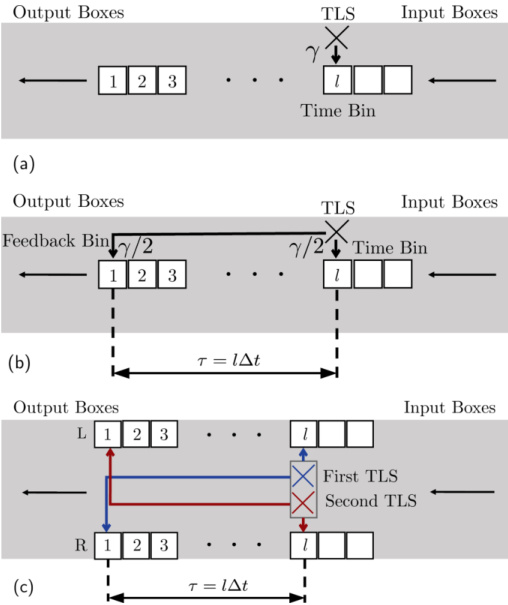{width=40%} FIG. 9. Three systems of interest in waveguide QED, coupling one or two TLS to waveguides with and without a time-delayed coherent feedback. Each case is represented in the time frame, where the movement of one bin represents one time step. The TLSs are interacting with their corresponding time bin as time evolves. In the cases where a feedback is considered, the TLS (or TLSs) will interact with two different time bins at the same time step, as indicated with the arrows between them. (a) MPS schematic of a single TLS embedded in an infinite waveguide. (b) MPS schematic of a single TLS embedded in a terminated waveguide, with a time delayed feedback ($\tau = L_0/c$). (c) MPS schematic of two TLSs embedded in an infinite waveguide with a delay length (or time) between them.

bin. This will be done with a swap MPO, $V_{\mathrm{swap}}$, applied on both sites, together with another SVD [80,81]. It is important to point out that the OC is kept in the system bin, as it must be in one of the bins involved in each operation. Furthermore, it is also necessary for computing the TLS population. Iterating this process, we can see the evolution on the TLS in the waveguide, computing the TLS population for each time step (time bin).

The evolution becomes more complicated once a time-delayed feedback is introduced [see Fig. 9(b)]. Now, there are three bins involved in the evolution: the system bin, the current time bin and the time bin involving the feedback, called the feedback bin. This last bin is not situated next to the other two, which means that now our Hamiltonian has a long range interaction. In order to avoid contracting all the bins between the feedback bin and the system bin for operating the time-evolution operator, the feedback bin is brought next to the system bin using $V_{\text{swap}}$ (Fig. 11). After each swap, a SVD must be done in order to keep the canonical form. In addition, the OC must be kept in the feedback bin to apply the swap operator. Once the feedback bin is next to the system

 ---------------------------------------------[ 第10页 ]---------------------------------------------  

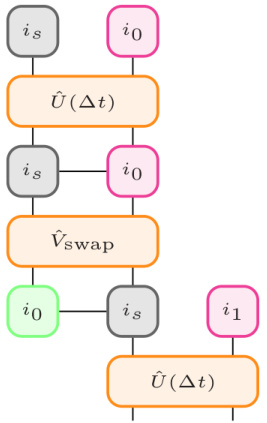{width=21%} FIG. 10. Diagrammatic representation of the first time step in which the time-evolution operator is applied. Subsequently, the swap operator is applied to bring the TLS bin to the right, leaving it ready for the next time step as can be seen in the last line. Green boxes represent left-normalize bins, magenta boxes represent right-normalized boxes, and the grey one is the OC. The operators are represented in orange and with the addition of a hat.

one, the three bins are contracted and $U$ is applied on them. Subsequently, two SVD are performed to recover the three different bins and the OC is brought to the system bin in order to compute the TLS population (Fig. 12). Then $V_{\text{swap}}$ is applied to the system and time bin to leave the system ready for the next time step and the OC is changed to the time bin (Fig. 13). On the other hand, a series of $V_{\text{swap}}$ are also applied to bring back the feedback bin to its corresponding position. Each operation is followed by a SVD and after the first operation the OC is kept another time in the feedback bin. This procedure is then repeated for each time step.

Finally, when working with two TLSs [see Fig. 9(c)], the procedure is similar to the one described for the feedback case, following also the steps shown in Figs. 11-14, but now with the time-evolution operator shown in Eq. (53). In this case, the two time bins involved correspond to the two TLSs. The main difference is that a new basis is introduced as the system bin now includes the two TLSs; hence, it will have a dimension $d=4$ [Eq. (63)], and each time bin will also have a dimension $d=4$ [Eq. (64)], as it counts the left and right moving photons. This can be seen in Fig. 9(c), where the TLSs are represented together. In addition, each time bin contains both boxes (from $R$ and $L$) labeled with the same number.

# E. Implementing the MPS algorithm in PYTHON

The systems described are implemented in PYTHON (specifically 3.7) to obtain their time evolution and compare later with the SDW model results (described below). The general descriptions below can of course also be adapted to other programming environments such as C, C++, and MATLAB.

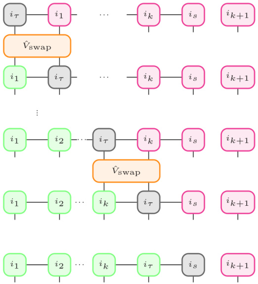{width=41%} FIG. 11. Diagrammatic representation of the first part of a single time step, in which the swap operator is applied to bring the feedback bin next to the system bin, and the OC is brought to the system bin. Green boxes represent left-normalize bins, magenta boxes represent right-normalized boxes, and the grey one is the OC.

Firstly, the one site operators are written as matrices. This includes the noise operators of the time bins and the creation and annihilation operators for the TLS.

Once these basic operators are defined, the time evolution, swap operator and the TLS population are defined, following the equations shown in Secs. III C and III B. As described before, these operators are represented as tensors. The time-evolution operator is easily defined in PYTHON using the exponential function included in the SCIPY LINALG package. This function is very efficient, allowing us to avoid any approximation or expansions that are frequently done for approximating the exponential of an operator [47]. The terms in the exponential can be created by making use of the basic operators already defined which will be multiplied via the Kronecker product of arrays included in the NUMY package.

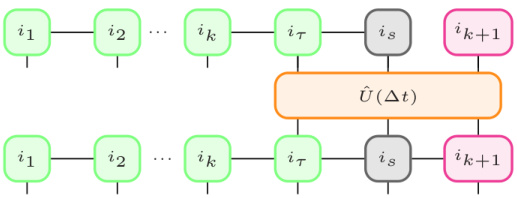{width=41%} FIG. 12. Diagrammatic representation of the application of the local operator U on the feedback, system and time bins. The OC is left in the system bin.

 ---------------------------------------------[ 第11页 ]---------------------------------------------  

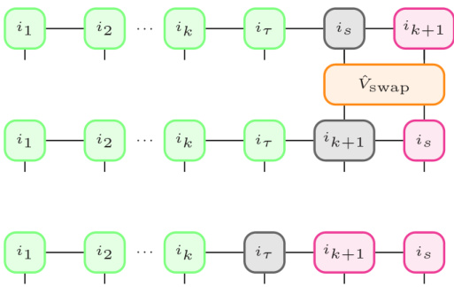{width=41%} FIG. 13. Diagrammatic representation of the swap operation for leaving the system bin on the right, ready for the next time step. The OC is moved back to the feedback bin.

For the initialization at time zero, the initial state is defined as follows:

$$
\psi ( 0 ) = A ^{i _ { 0} } \otimes A ^{i _ { i} } ,
$$

or in index notation,

$$
\psi ( 0 ) = \sum _ { a , b , c , d } A _ { a , b } ^{i _ { 0} } A _ { c , d } ^{i _ { 1} } ,
$$

where $a$, $b$, $c$, $d=1$, $bond$. Here, $a$, $b$ and $c$, $d$ correspond to the virtual links of the time bin and the TLS, respectively, and $i_0$ and $i_s$ to the physical links. The dimension of the physical indices is $d=2$ in the case of one TLS and $d=4$ in the case of two TLSs, and the initial bond dimension is 1 as there is no initial entanglement. The bond dimension will increase as the entanglement appears, and it will be limited to a determinate dimension which will vary depending on the precision of each case. A chosen value will be used, and increased manually if necessary.

For example, for one TLS initialized in the ground state and the waveguide in vacuum, we have

$$
A ^{i _ { \mathrm { t} } } = { \left[ \begin{array}{l} { 1 } \\{ 0 } \end{array} \right] } ,  A ^{i _ { \mathrm { 0} } } = { \left[ \begin{array}{l} { 1 } \\{ 0 } \end{array} \right] } ,
$$

where $A^{i_{x}}$ represents the TLS bin, and $A^{i_{0}}$ represents the first time bin.

Alternatively, if the TLS is initially in the excited state, then

$$
A ^{i _ { x} } = \left[ \begin{array}{l} { 0 } \\{ 1 } \end{array} \right] .
$$

In the case of two TLSs, the initial state will be the outer product of each TLS. If both start in the ground state, then

$$
A ^{i _ { i} } = \left[ \begin{array}{l} { 1 } \\{ 0 } \end{array} \right] \otimes \left[ \begin{array}{l} { 1 } \\{ 0 } \end{array} \right] = \left[ \begin{array}{l} { 1 } \\{ 0 } \\{ 0 } \end{array} \right] .
$$

Note that when we have one TLS in the MPS scheme, we shall refer to the TLS system bin, and for two TLSs, we shall refer to the TLSs bin, in the sense that we consider a common

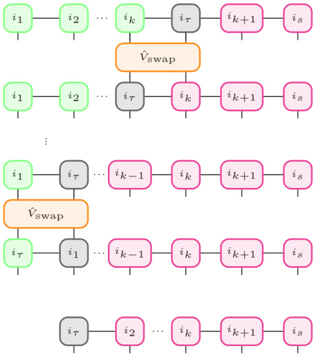{width=41%} FIG. 14. Diagrammatic representation of the swap back steps using the swap operator $V_{\text{swap}}$ for leaving the feedback bin in its original position, that is, on the left. After finishing these operations, the OC is left in the first time bin which is renamed as $i_{\tau}$ becoming the new feedback bin for the next time step.

bin labeling with both TLSs. Thus, later, when we explore entanglement between the TLSs bin and the waveguide, we are treating the two TLSs as a common system (which of course, also become entangled in their reduced Hilbert space).

If any of the TLSs starts in an excited state, then the excited TLS will be written as in Eq. (70), e.g.,

$$
A ^{i _ { i} } = \left[ \begin{array}{l} { 1 } \\{ 0 } \end{array} \right] \otimes \left[ \begin{array}{l} { 0 } \\{ 1 } \end{array} \right] = \left[ \begin{array}{l} { 0 } \\{ 1 } \\{ 0 } \end{array} \right] .
$$

Similarly, the waveguide is in vacuum which means there will not be moving photons in either direction of the waveguide, giving the following initial state:

$$
A ^{i _ { 0} } = \left[ \begin{array}{l} { 1 } \\{ 0 } \end{array} \right] \otimes \left[ \begin{array}{l} { 1 } \\{ 0 } \end{array} \right] = \left[ \begin{array}{l} { 1 } \\{ 0 } \\{ 0 } \end{array} \right] .
$$

Although it will not be studied in this paper, having a initial state of waveguide photons is also possible, e.g., see Refs. [82,83].

In order to operate the MPO on the MPS, we make use of the function NCON [84], which is a tensor network contractor that contracts the common indices in each case, and summed indices are reduced to a single tensor or a number by evaluating the index sums. After each contraction a SVD must be performed. This is done with the SVD function predefined

 ---------------------------------------------[ 第12页 ]---------------------------------------------  

in the SCIPY LINALG package for PYTHON. It will give us the left normalized matrix, the right normalized one and the Schmidt coefficients. These last ones will be contracted with any of them (depending the case) to recover the OC after each operation.

With those functions and following the steps shown in Sec. III.D, the evolution of each system is computed, with various initial conditions and pumping strengths.

# IV. SPACE-DISCRETIZED WAVEGUIDE MODEL

An alternative, but less well developed, approach to modeling waveguide QED is to use a "collision model" where the system repeatedly interacts with discrete slices (or bins) of the environment [42,45,49,50]. This model can be integrated with the physical insight of QT theory [85-87] and an intuitive strategy for modeling non-Markovian dynamics emerges. Namely, by expanding the entire system to include the waveguide it is interacting with (represented by say small spatial boxes), the whole system dynamics become Markovian again, similar to how one solves Maxwell's equation on a finite-size space grid. Thus we can model the waveguide by slicing it into discrete time/space bins and simulate the full system dynamics using QT theory. This general approach was recently used [43] to model the dynamics of a single TLS with time-delayed coherent feedback. We further explain how to implement this model for two TLSs in an open waveguide as well as expand the model to include Lindblad output channels required for realistic simulation of relevant experimental setups such as with semiconductor QED systems and circuit-QED systems. Also, since the SDW model uses QT theory as its backbone, it can give insight into individual realizations of the system stochastic dynamics on top of the ensemble average [85-87]. Indeed, as we will show below, the SDW model leads to a picture of delayed conditioning for simulating the emission of a photon. This is an effect that is not captured in standard QT theory. In addition, from a computational perspective, the independent nature of the individual trajectories allows for the SDW approach to be completely parallelizable and make use of modern computational infrastructures such as single machine multithreading or computational clusters.

To model an open waveguide over some space interval $[-L_0, 0]$, we would typically describe it using the annihilation operators for the discrete frequency domain modes of the waveguide propagating to the left ($L$) or right ($R$), $b_{k,\alpha}$ with $\alpha \in [L, R]$. Instead, the collision model transforms these operators into their time domain representations $B_{n,\alpha}$ using a discrete Fourier transform. This gives the explicit relationship

$$
\begin{array}{r} { B _ { n , \alpha } = \frac { 1 } { \sqrt { N } } \sum _ { k = 0 } ^{N - 1} b _ { k , \alpha } e ^{( - 1 ) ^ { m _ { \alpha} } i \omega _ { k } n \Delta t } , } \\{ b _ { k , \alpha } = \frac { 1 } { \sqrt { N } } \sum _ { n = 0 } ^{N - 1} B _ { n , \alpha } e ^{( - 1 ) ^ { m _ { \alpha} + 1 } i \omega _ { k } n \Delta t } , } \end{array}
$$

where $\Delta t = L_0/N$ is the time domain sampling (i.e., the corresponding time bin step for each spatial slice), $\omega_k = 2\pi k/L_0$, which assumes linear dispersion in the waveguide, and $m_{L,R} = 1, 2$, which ensures the correct direction of propagation for

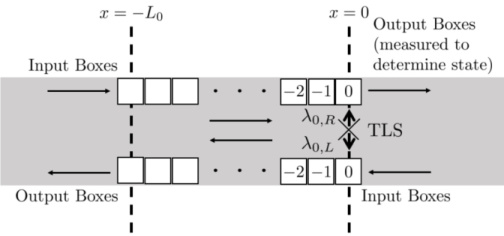{width=40%} FIG. 15. Schematic of a single TLS embedded in an open waveguide in the SDW model. The boxes are labeled by the negative of their index to emphasize that the spatial location of box $n$ is $x_n = -n\Delta t$, i.e., as the box number increases the corresponding location moves in the negative $x$ direction.

the boxes in Eq. (77). With this representation, $B_{n,\alpha}$ can be thought of as representing all frequency modes of the field across the spatial length $-n\Delta t$ to $-(n+1)\Delta t$, with the commutator

$$
[ B _ { n , \alpha } , B _ { n ^{\prime} , \alpha } ^{\dagger} ] = \delta _ { n , n ^{\prime} } .
$$

It is important to note that these $B_{n,\alpha}$ operators are distinct from the $\Delta B_{\alpha}(t_k)$ operators introduced in the MPS description of the waveguide system. In the MPS formalism, the complete waveguide is described by the continuous time domain operators [Eq. (43)] and $\Delta B_{\alpha}(t_k)$ is a discrete time step of the interaction between the system and waveguide. Notably, the number of $\Delta B_{\alpha}(t_k)$ operators can grow as large as needed to reach the desired end time for the model. The growing Hilbert space is then truncated through the SVDs to keep this exact approach to the waveguide numerically tractable. In contrast, in the SDW model, there are a finite number of $B_{n,\alpha}$ operators set at the beginning of the simulation by choice of $\Delta t$. The waveguide is then exactly described over the length of interest covered by these spatial operators, and the evolution out of this length (and into the rest of the open waveguide) is dealt with through stochastic measurements of the outgoing boxes as described later. This trades out the exact approach of MPS with SVDs for a stochastic approach where individual realizations of the system must be averaged over. An advantage of this approach is that the ket state includes the waveguide section being modelled and contains the full entanglement between the waveguide and interacting QO system (e.g., a TLS). This is schematically shown in Fig. 15, where a TLS is coupled to an open waveguide in the SDW model.

Before including a waveguide QO system, it is important to understand how the waveguide evolves in the SDW model. As in the MPS description, the waveguide undergoes free evolution of the frequency modes under the discrete form of the free Hamiltonian in Eq. (12), which is now written as

$$
H _ { \mathrm { W } } ( \omega ) = \sum _ { \alpha \in \{ L , R \} } \sum _ { k = 0 } ^{N - 1} \omega _ { k } b _ { k , \alpha } ^{\dagger} b _ { k , \alpha } .
$$

Then the evolution of the waveguide over a single time step is given by the operator $U_{\mathrm{W}}(\Delta t)=e^{-iH_{\mathrm{W}}\Delta t}$. This gives the evolution of the spatial operators for the right propagating

 ---------------------------------------------[ 第13页 ]---------------------------------------------  

modes as

$$
\begin{array}{r} { U _ { \mathrm { W } } ^{\dagger} ( \Delta t ) B _ { n , R } U _ { \mathrm { W } } ( \Delta t ) = \frac { 1 } { \sqrt { N } } \sum _ { k = 0 } ^{N - 1} b _ { k , R } e ^{i \omega _ { k} ( n - 1 ) \Delta t } } \\{ = B _ { n - 1 , R } , } \end{array}
$$

while for the left propagating modes:

$$
U _ { \mathbf { W } } ^{\dagger} ( \Delta t ) B _ { n , L } U _ { \mathbf { W } } ( \Delta t ) = B _ { n + 1 , L } .
$$

Therefore, over each time step, the waveguide evolves by passing along one "box" of the waveguide to the next. The boxes moving to the right flow from the $N-1$'th box to the 0'th box, and the boxes moving to the left flow from the 0'th box to the $N-1$'th box, as shown in Fig. 15.

Explicitly, the ket vector for the waveguide is now

$$
| \psi _ { \mathrm { W } } \rangle = \prod _ { \alpha \in [ L , R ] } | l _ { N - 1 , \alpha } , \ldots , l _ { 0 , \alpha } \rangle ~ ,
$$

where $|l_{n,\alpha}\rangle$ is the number state from $-n\Delta t$ to $-(n+1)\Delta t$. In order to keep the size of this basis numerically accessible for simulations, we make two assumptions. First, $l_{n,\alpha} \in \{0, 1\}$ so that in each directional box of the waveguide there is a maximum of one photon. Second, we fix $\sum_{\alpha \in [L,R]} \sum_{n=0}^{N-1} l_{n,\alpha} = M$, allowing for a maximum of $M$ excitations in the waveguide, where we can choose $M$ to maintain a basis size which is numerically accessible, typically this choice is $M = 1$ or $2$ (and we will use both later). These assumptions are good as long as $\Delta t$ is sufficiently small (equivalently, $N$ is sufficiently large) so that the dynamics of the interaction Hamiltonian are well resolved.

Unlike in the MPS formalism, once the photon has left the modelled waveguide segment, it is not accounted for in the system state. Therefore, before $U_{\mathrm{W}}(\Delta t)$ can be applied and the waveguide boxes move forward, the information in the final box must be accounted for. To do this, Eq. (79) can be separated into three components; one where the final box of each directional set of boxes is empty and two where each final box contains a photon but the other does not, so that

$$
\begin{array}{rl} & { | \psi _ { \mathrm { W } } ( t ) \rangle = | \psi _ { 0 } ( t ) \rangle \, | I _ { 0 , L } = 0 \rangle \, | I _ { 0 , R } = 0 \rangle } \\& {  + \; | \psi _ { 1 , L } ( t ) \rangle \, | I _ { 0 , L } = 1 \rangle \, | I _ { 0 , R } = 0 \rangle } \\& {  + \; | \psi _ { 1 , R } ( t ) \rangle \, | I _ { 0 , L } = 0 \rangle \, | I _ { 0 , R } = 1 \rangle \; . } \end{array}
$$

A simulated "measurement" is made on each of the final boxes with probability $\langle\psi_{1,\alpha}(t)|\psi_{1,\alpha}(t)\rangle$, similar to the check for a quantum jump in the QT formalism [85–87]. Here we make the approximation that the photon can only be measured in one of the final boxes each time step, which avoids the simultaneous detection of two photons. If a photon is determined to be present in the box propagating in direction $\alpha$, the system is projected into the $|\psi_{1,\alpha}(t)\rangle$ state and both final boxes are emptied. If no photon is present, the system is projected into the $|\psi_0(t)\rangle$ state with both final boxes already emptied. Then $U_W(\Delta t)$ can be applied to the system with periodic boundary conditions,

$$
\begin{array}{r} { | \psi _ { \mathrm { W } } ( t ) \rangle = \displaystyle \prod _ { \alpha \in \{ L , R \} } | l _ { N - 1 , \alpha } , \ldots , l _ { 0 , \alpha } \rangle \, , } \\{ | \psi _ { \mathrm { W } } ^{\prime} ( t + \Delta t ) \rangle = \displaystyle \prod _ { \alpha \in \{ L , R \} } | 0 , l _ { N - 1 , \alpha } , \ldots , l _ { 1 , \alpha } \rangle \, , } \end{array}
$$

without losing any information. This process does not conserve the norm of the system and so before the time step can be completed, the system must be renormalized. Thus the ket vector for the waveguide after each time step is

$$
| \psi _ { \mathrm { W } } ( t + \Delta t ) \rangle = \frac { | \psi _ { \mathrm { W } } ^{\prime} ( t + \Delta t ) \rangle } { ( \psi _ { \mathrm { W } } ^{\prime} ( t + \Delta t ) | \psi _ { \mathrm { W } } ^{\prime} ( t + \Delta t ) \rangle } .
$$

Due to the stochastic nature of this approach, each realization of the system will be a QT which needs to be averaged against a suitable number of trajectories to arrive at the ensemble average behavior of the system. Also, by setting the new incoming boxes to be in the ground state, we are making the assumption that the incoming fields are empty, however this is not a strict restriction of the model.

This description of the waveguide will always be implemented as the final three steps of each time step. The final (outgoing) boxes will be measured to determine whether or not a photon is present and the state will be projected accordingly with the final boxes set to the vacuum state like an absorbing boundary condition. Then, the free evolution of the waveguide will be applied and all boxes stepped forward removing the now empty final box and introducing a new empty box at the start of the box chain. Lastly, the state must be renormalized before moving on to the next time step.

# A. Modeling the schemes of interest with space discretization

Before applying the SDW model to the systems of interest presented in Sec. II, we will explain how to apply this model to a general QO system of interest with the interaction Hamiltonian presented in the continuous frequency domain. The Hamiltonian for a waveguide coupled to some arbitrary QO system is

$$
H = H _ { \mathrm { S } } + H _ { \mathrm { W } } + H _ { \mathrm { I } } ,
$$

where $H_{\mathrm{S}}$ is the Hamiltonian for the arbitrary QO system (including pumping) and $H_{\mathrm{I}}$ is the interaction Hamiltonian between the system and waveguide. In the continuous frequency domain, this is

$$
H _ { 1 } = \sum _ { \alpha \in \{ L , R \} } \int _ { - \infty } ^{\infty} d \omega ( \kappa _ { \alpha } ( \omega ) a ^{\dagger} b _ { \alpha } ( \omega ) + \mathrm { H . c . } ) ,
$$

where $a$ ($a^{\dagger}$) is arbitrarily chosen as the annihilation (creation) operator for the system and $\kappa_{\alpha}(\omega)$ is the frequency dependent coupling function between the QO system and the $\alpha$ directional frequency mode in the waveguide.

Equation (84) is next transformed into the discrete frequency domain by converting the continuous integral to a discrete sum over the frequency modes and substituting the continuous operators to the discrete operators $b_{k,\alpha}$. The result of this transformation is to introduce a factor of $\sqrt{2\pi/L_0}$ to the Hamiltonian

$$
H _ { 1 } = \sqrt { \frac { 2 \pi } { L _ { 0 } } } \sum _ { \alpha \in \{ L , R \} } \sum _ { k = 0 } ^{N - 1} ( \kappa _ { \alpha } ( \omega _ { k } ) a ^{\dagger} b _ { k , \alpha } + \mathrm { H . c . } ) .
$$

 ---------------------------------------------[ 第14页 ]---------------------------------------------  

Lastly, the interaction is transformed into the spatial frame by direct substitution of Eq. (74) for $b_{k,\alpha}$, giving

$$
H _ { 1 } = \sum _ { \alpha \in \{ L , R \} } \sum _ { n = 0 } ^{N - 1} ( \lambda _ { n , \alpha } a ^{\dagger} B _ { n , \alpha } + \mathrm { H . c . } ) ,
$$

where

$$
\lambda _ { n , \alpha } = \sqrt { \frac { 2 \pi } { N L _ { 0 } } } \sum _ { k = 0 } ^{N - 1} \kappa _ { \alpha } ( \omega _ { k } ) e ^{( - 1 ) ^ { m _ { \alpha} + 1 } i \omega _ { k } n \Delta t } .
$$

Then the system couples to the $n$'th waveguide box with a coupling rate of $\lambda_{\eta}$ for $n \in \{0, \ldots, N-1\}$. This setup allows the system to couple to the waveguide at an arbitrary number of places, but in practice this is restricted to one or two choices for $n$ for this paper through the choice of $\kappa_{\alpha}(\omega_{k})$.

Therefore the complete ket vector for the model is

$$
| \psi ( t ) \rangle = | \psi _ { \mathrm { S } } ( t ) \rangle \, | \psi _ { \mathrm { W } } ( t ) \rangle \, ,
$$

where $|\psi_{\mathrm{S}}(t)\rangle$ is the ket vector for the QO system of interest. The simulation over one time step ($\Delta t$) following a four step algorithm:

(1) Evolve $|\psi(t)\rangle$ under the combined QO system and interaction Hamiltonians, $H_{\mathrm{S}}+H_{\mathrm{I}}$, by direct application of $e^{-i(H_{\mathrm{S}}+H_{\mathrm{I}})\Delta t}$.

(2) Take a direct measurement on the final boxes of the waveguide and project the ket vector accordingly.

(3) Shift the waveguide boxes one step under the operator $U_{\mathrm{W}}(\Delta t)$.

(4) Renormalize the system, so that the next ket state (after the time step) is

$$
| \psi ( t + \Delta t ) \rangle = { \frac { | \psi _ { \mathrm { S } } ( t + \Delta t ) \rangle \, | \psi _ { \mathrm { W } } ^{\prime} ( t + \Delta t ) \rangle } { \langle \psi _ { \mathrm { W } } ^{\prime} ( t + \Delta t ) | \psi _ { \mathrm { W } } ^{\prime} ( t + \Delta t ) \rangle } } .
$$

In the following three parts, we will derive the interaction Hamiltonian for the three schemes of interest shown in Fig. 1, with the Hamiltonians described in Sec. II.

# 1. Scheme (i): single two-level system in an infinite waveguide

The initial system of interest is a single TLS in an infinite waveguide as shown in Fig. 1(a). For this scheme, the continuous coupling function is $\kappa_{\alpha}(\omega_{0})=\sqrt{\gamma_{\alpha}/2\pi}$, where we allow for non-equal coupling to the left and right propagating modes of the waveguide. Then the spatial coupling function to the right is

$$
\lambda _ { n , R } = \sqrt { \frac { 2 \pi } { N L _ { 0 } } } \sum _ { k = 0 } ^{N - 1} \sqrt { \frac { \gamma _ { R } } { 2 \pi } } e ^{- i \omega _ { k} n \Delta t } = \sqrt { \frac { \gamma _ { R } } { \Delta t } } \delta _ { 0 , n } ,
$$

where we have used the identity

$$
\delta _ { n , m } = 1 / N \sum _ { k = 0 } ^{N - 1} e ^{i \frac { 2 \pi k} { N } ( n - m ) } ,
$$

and similarly $\lambda_{n,L}=\sqrt{\gamma_{L}/\Delta t}\,\delta_{0,n}$. Although this derivation of the spatial coupling functions may seem somewhat circular, it makes a clear connection to the more common frequency domain representations of the interaction Hamiltonian (for waveguides) and follows a general approach to deriving these functions.

Since the dynamics of the photons in the waveguide are unimportant after leaving the TLS, the interaction with the

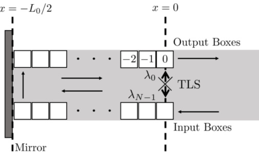{width=40%} FIG. 16. Schematic of a single TLS embedded in a half open waveguide introducing time-delayed feedback to the system in the SDW model.

waveguide can be described by a single box, and the interaction Hamiltonian is simply

$$
H _ { l } = \sum _ { \alpha \in \{ L , R \} } \sqrt { \frac { \gamma _ { \alpha } } { \Delta t } } [ \sigma ^{+} B _ { 0 , \alpha } + \mathrm { H . c . } ] .
$$

It is also worth highlighting that an alternative approach to deriving the interaction Hamiltonian in the SDW model is to simply represent the waveguide by the total waveguide field at the location of the TLS ($x=0$), $\mathcal{E}_{L}(0)+\mathcal{E}_{R}(0)$. Then the interaction Hamiltonian is

$$
H _ { 1 } = \sum _ { \alpha \in [ L , R ] } \sqrt { \gamma _ { \alpha } } [ \sigma ^{+} \mathcal { E } _ { \alpha } ( 0 ) + \mathrm { H . c . } ] ,
$$

where this presumes $\mathcal{E}_{\alpha}(0)$ is written in photon flux units and can thus be replaced with $\mathcal{E}_{\alpha}(0)=B_{0,\alpha}/\sqrt{\Delta t}$, since $B_{0,\alpha}$ is the spatial box at the location of the TLS. Thus we obtain the same result [cf. Eq. (92)]. Note that shifting the spatial box that the TLS is located will simply introduce $\exp(\pm i\omega x_{0})$ factors to the fields, and thus shift the spatial box that the TLS couples to.

# 2. Scheme (ii): single two-level system in a half open waveguide with a time-delayed coherent feedback

In order to include time-delayed feedback as shown in Fig. 1(b), we have to slightly change our approach to implementing the SDW model. Since the field that is emitted into the waveguide to the left is returned as the right propagating field from the mirror, we only need to use one set of boxes. These boxes enter, empty, travel to the left, propagate down the waveguide to the mirror, where they are reflected, and return to the TLS as the right propagating boxes. Once they arrive at the TLS, the box and TLS interact again and then the box leaves the system where it is measured for a photon. This is shown schematically in Fig. 16.

The two coupling functions for this system are

$$
\begin{array}{r} { \kappa _ { L } ( \omega _ { 0 } ) = \sqrt { \frac { \gamma _ { L } } { 2 \pi } } , } \\{ \kappa _ { R } ( \omega ) = \sqrt { \frac { \gamma _ { R } } { 2 \pi } } e ^{i \phi} e ^{i \omega \tau} , } \end{array}
$$

 ---------------------------------------------[ 第15页 ]---------------------------------------------  

where $\kappa_{R}(\omega)$ picks up the round trip phase of the photon in the interaction picture. Thus the coupling to the left is identical to the coupling without feedback, $\lambda_{n,L}=\sqrt{\gamma_{L}/\Delta t}\,\delta_{0,n}$, and the coupling to the right is

$$
\begin{array}{r} { \lambda _ { n , R } = \sqrt { \frac { 2 \pi } { N L _ { 0 } } } \sum _ { k = 0 } ^{N - 1} \sqrt { \frac { \gamma R } { 2 \pi } } e ^{i \phi} e ^{- i \omega _ { k} ( n \Delta t - \tau ) } , } \\{ = e ^{i \phi} \sqrt { \frac { \gamma R } { \Delta t } } \delta _ { n , - ( N - 1 ) } , } \end{array}
$$

modified by the presence of the mirror.

Of course, $n = -(N - 1)$ does not occur for $n \in \{0, \ldots, N - 1\}$, so we reparameterize and set the fictional $-(N - 1)$ box to be 0 and box 0 to be $N - 1$. Therefore the interaction Hamiltonian for this scheme is

$$
\begin{array}{r} { H _ { 1 } = \sqrt { \frac { \gamma _ { L } } { \Delta t } } [ \sigma ^{+} B _ { N - 1 } + \mathrm { H . c . } ] } \\{ + e ^{i \phi} \sqrt { \frac { \gamma _ { R } } { \Delta t } } [ \sigma ^{+} B _ { 0 } + \mathrm { H . c . } ] , } \end{array}
$$

where the directional subscript on $B_{n}$ has been dropped since there is only one set of boxes needed for this scheme.

# 3. Scheme (iii): two waveguide-coupled two-level systems separated by a time delay

The third scheme of interest is two spatially separated TLSs in an open waveguide as depicted in Fig. 1(c). This system is commonly investigated under the assumption that the spatial separation is negligible to the dynamics of the system in order to recover Markovian dynamics (thus neglecting time retardation), and when the non-Markovian effects are included, it is commonly in the single excitation regime [88]. We can relax this assumption with the SDW model and treat the non-Markovian effects from the separation of the TLSs with dynamics from up to four quanta in the entire system included (one in each TLS and two in the waveguide). The approach to modeling this system is similar to that of scheme (i), but now more than one box is needed to model the waveguide. Instead, $N$ boxes are introduced which span the distance between the two TLSs, shown schematically in Fig. 17.

There are now four coupling functions which must be converted into their respective spatial coupling functions. These

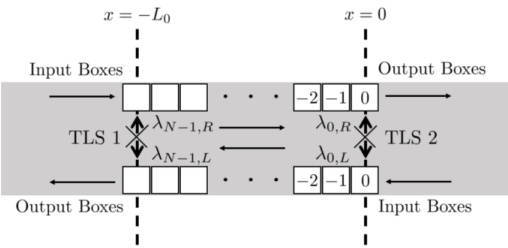{width=40%} FIG. 17. Schematic of two TLSs embedded in an open waveguide with non-negligible separation between them in the SDW model.

coupling functions are presented in Eq. (28), and following a similar approach to the previous two sections, the interaction Hamiltonian in the SDW model is

$$
\begin{array}{r} { H _ { 1 } = e ^{i \phi} \sqrt { \frac { \gamma L _ { 1 } } { \Delta t } } [ \sigma _ { 1 } ^{+} B _ { N - 1 , L } + \mathrm { H . c . } ] } \\{ + e ^{- i \phi} \sqrt { \frac { \gamma R _ { 1 } } { \Delta t } } [ \sigma _ { 1 } ^{+} B _ { N - 1 , R } + \mathrm { H . c . } ] } \\{ + \sqrt { \frac { \gamma L _ { 2 } } { \Delta t } } [ \sigma _ { 2 } ^{+} B _ { 0 , L } + \mathrm { H . c . } ] } \\{ + \sqrt { \frac { \gamma R _ { 2 } } { \Delta t } } [ \sigma _ { 2 } ^{+} B _ { 0 , R } + \mathrm { H . c . } ] . } \end{array}
$$

# B. Introducing Lindblad output channels

A central result of previous studies on coherent feedback systems is the ability to tune the phase of the returning feedback to enhance or suppress the output from the system. However, it is important to note that in physically realized systems, such as semiconductor quantum dots [35,51–59], feedback systems are ultimately less effective when one accounts for dissipation processes such as off-chip decay from the TLS and pure dephasing. To include these processes in the SDW model, our algorithm is amended to include Lindblad quantum jump operators from conventional QT theory [85–87].

As an example, the previous schemes can be augmented by two quantum jump operators $C_{0}=\sqrt{\gamma_{0}\sigma^{-}}$, representing off-chip decay from the TLS with rate $\gamma_{0}$, and $C_{1}=\sqrt{\gamma'/2\sigma_{z}}$, representing pure dephasing in the TLS with rate $\gamma'$. It is important to note that the MPS approach neglects these terms and it is not clear how to include them in a numerically efficient way. In contrast, due to the already stochastic nature of the SDW model, including these output channels is quite natural and is one of the major advantages of exploiting QT theory to model waveguide QED.

In order to include these jumps, the algorithm's first step must be modified by evolving each QT under a non-Hermitian effective Hamiltonian,

$$
H _ { \mathrm { e f f } } = H _ { \mathrm { S } } + H _ { \mathrm { I } } - \frac { i } { 2 } \sum _ { j = 0 } ^{1} C _ { j } ^{\dagger} C _ { j } .
$$

This evolution is further modified by stochastically introducing quantum jumps with a jump probability of

$$
P ( t ) = \Delta t \sum _ { j } \langle \psi ( t ) | C _ { j } ^{\dagger} C _ { j } | \psi ( t ) \rangle ~ ,
$$

for the time step beginning at $t$. If a jump is determined to occur, either $C_0$ or $C_1$ is chosen to be applied to the system according to their relative probabilities. Note, an alternative approach to include the above processes is to add further streams of little boxes, one stream for each additional decay or dephasing channel. However, we find our presented QT formalism to be more intuitive.

Since neither the evolution under $H_{\mathrm{eff}}$ or applying either quantum jump preserves the state norm, before moving on to the measurement of the final box in the second step of the algorithm, the state must be renormalized. Thus there

 ---------------------------------------------[ 第16页 ]---------------------------------------------  

must be two renormalizations during each step of the system evolution.

It is also important to note that, unlike in typical QT theory, if a quantum jump occurs, the waveguide Hamiltonian is still applied to the system, i.e., the boxes still shift. For a typical QT, if a jump occurs, the Hamiltonian is not applied to the system and instead the jump operator is applied. If this were to be followed for this model with feedback, then the feedback would return to the system at irregular times. Therefore the waveguide Hamiltonian must be decoupled from the system and interaction Hamiltonians in order to maintain a consistent round trip time for the feedback.

# C. Implementation in PYTHON

One of the major benefits of the SDW model is the ease of implementing the model in the users preferred coding language, especially if the user is familiar with QTs in general. Similar to our MPS implementation, our SDW implementation uses PYTHON 3.7, which exploits its straightforward parallelization abilities and the sparse matrix capabilities of SCIPY.

To begin a simulation, the ket vector is initialized as an outer product of $|\psi_{\mathrm{S}}\rangle$ and $|\psi_{\mathrm{W}}\rangle$, which is represented as a vector of length $N_{\mathrm{S}} \times \sum_{j=0}^{M}\binom{2N}{j}$; here $N_{\mathrm{S}}$ the size of the QO system basis and $\sum_{j=0}^{M}\binom{2N}{j}$ the size of the waveguide basis. Note that $2N$ is used in the factorial because the limit of $M$ photons in the waveguide encompasses both directions of field propagation in the loop (the 2 is dropped for the feedback scheme since there is only one row of boxes). To give an example, for a typical simulation, we would choose 20 boxes ($N=20$) and allow for two photons in the loop ($M=2$) which gives a vector length of 422 for the single TLS with feedback and 3284 for two TLSs in an open waveguide. The evolution under $e^{-iH_{\mathrm{eff}}\Delta t}$ is done similarly to our MPS implementation by utilizing the exponential function in SCIPY LINALG, but we also convert it into a sparse matrix to save both memory and computation time since there are many levels of the ket vector which do not interact.

The simulation then runs by following the algorithm described in Sec. IV A, implementing each time step (with Lindblad output channels included) until the desired end time is reached. First, there is a check for whether a quantum jump from the Lindblad output channels occurs, with probability $P(t)$ (99). To do this check, a uniformly distributed random number $\epsilon$ is generated and compared against $P(t)$. If $\epsilon < P(t)$ then a jump occurs, with the responsible jump operator chosen from their respective relative probabilities compared against a second uniformly distributed random number. Otherwise, if $\epsilon > P(t)$, then the system ket vector is evolved by direct multiplication of $e^{-iH_{\mathrm{em}} \Delta t}$ and then renormalized. Note that this step can be done with a smaller time step, $\delta t < \Delta t$, multiple times per large time step in order to resolve fast system Hamiltonian dynamics. Other methods of evolution can be used such as various Runge-Kutta approaches, however these require a larger number of calculations per time step and can slow down the numerics significantly for small gains in accuracy. Next, a direct measurement of the output boxes is taken to determine if a photon leaves the system from the waveguide. This is im

implemented similarly to the Lindblad jump operators with the probabilities now given by $\langle\psi_{1,\alpha}(t)|\psi_{1,\alpha}(t)\rangle$. Penultimately, the waveguide boxes are all shifted forward, and lastly, the ket vector is renormalized again.

The benefits of this implementation is that essentially each step of the code is obtained by simply writing down the explicit mathematical calculation that needs to be done without any outside functions. This makes the implementation quite easy and transparent for a simple system. The complexity arises as the system of interest becomes more intricate, for example through the inclusion of more Lindblad output channels or complex QO systems. Also, since the ket vector is known at each time step, any desired observables can be calculated either during or after the trajectory.

Of course, since each QT simulated is a single realization of the scheme of interest, in order to recover the ensemble average dynamics these trajectories must be averaged over a large number of realizations. Depending on the system dynamics or the desired precision of the observable, this can require anywhere from 500 to 10 000 trajectories. Since each trajectory is inherently independent of the other trajectories, this implementation is a prime candidate for parallelization across multiple CPUs which we have done using the MPI4PY package for PYTHON. This can also make use of the multithreading on a single high-performance workstation or the many nodes of a computing cluster.

In order to reduce the computation time when running large numbers of trajectories, we run an initial sample trajectory where quantum jumps are forbidden to occur. At each time step in this sample trajectory we calculate the probability for a jump to occur through any of our jump channels. Then, for each trajectory we simulate, we simply generate an array of uniformly distributed random numbers and compare these against the calculated probabilities to decide when the first jump occurs. This avoids having to run identical dynamics for each trajectory until the first jump since it is identical to the dynamics of the sample trajectory.

# V. RESULTS

In this section, we present numerical results of the two methods discussed in detail above. For convenience, we will present the graphical results in normalized units, in terms of $\gamma$, defined from: $\tilde{t}=t\gamma$, $\tilde{\tau}=\tau\gamma$, $\tilde{\Omega}=\Omega/\gamma$ $\tilde{\gamma}_0=\gamma_0/\gamma$, and $\tilde{\gamma}'=\gamma'/\gamma$.

# A. Single two-level system in a waveguide with and without a time-delayed feedback: vacuum dynamics

We will first explore the case of a single TLS in a waveguide, with and without feedback, beginning with the simple spontaneous emission dynamics in vacuum.

As discussed earlier, since the SDW model computes stochastic dynamics, expectation values can be obtained from an average over a finite number of trajectories. To make this clear, at the few QT level, in Fig. 18, we show single trajectories calculated with this model for a TLS in an infinite waveguide and for a half open waveguide with a feedback delay (see Secs. IIA and II B), with $\tilde{\tau}=1$ and $\phi=0$. We also compare these with the direct results given by the MPS,

 ---------------------------------------------[ 第17页 ]---------------------------------------------  

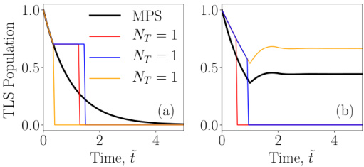{width=40%} FIG. 18. Vacuum decay of the TLS population for a single TLS in a waveguide with (a) no feedback, and (b) with feedback, using delay parameters $\bar{\tau}=1$, $\phi=\pi$. The MPS result is shown in black and the SDW model with a single QT is shown in the colored lines. The stochastic nature of the SDW model is clear, where for one trajectory the TLS population decays to the ground state or is trapped after a single jump [16]. Note that the SDW model results in delayed conditioning for single QT runs. The times shown are normalized to the decay rate, so the nominal decay rate of $\gamma$ would yield a population of $1/e\approx0.368$ at $\tilde{t}=1$, and thus for $\tilde{\tau}=1$, this is also precisely when the feedback effects start to appear.

which shows a smooth decay in the case of no feedback, and population trapping for the case of feedback, which recovers previous vacuum results [16,19,89]. Since we only show a single QT (which is deliberate), the results obviously do not overlap, since when one quantum jump happens, the TLS population simply decays to the ground or becomes trapped. However, for a larger number of trajectories, we recover excellent agreement from both the MPS and SDW models as shown below.

Note that standard QTs for spontaneous emission begin as horizontal lines with no exponential decay. In the present case, the exponential behavior occurs because there are 20 space bins interacting with the TLS before the interaction with the output bin begins; thus, the QTs are effectively conditioned on photon counts made downstream from the TLS.

In Fig. 19, we next study the same TLS decay for different feedback phases, yielding destructive interference with $\phi=0$ and constructive interference with $\phi=\pi$, and show how the number of QT averages affects the results when comparing with the MPSs. We now see how the phase can completely change the trapping scenario causing a faster decay with feedback when $\phi=0$. The MPS case is compared with 3 different cases for the SDW model, where 10, 100, and 2000 trajectories are considered. It can be seen that both methods agree extremely well in when $N_t=2000$, and we also show that both methods recover the simple analytical solution with no feedback, namely $n_a=\langle\sigma^+\sigma^-\rangle=\exp(-\gamma t)$. Note that there are other non-Markovian systems that lead to TLS population trapping, such as fractional decay near the edge of a photonic band gap [90,91], though in practice these would be very difficult to realize [92], most notably due to structural disorder [93].

Now that we have verified that both approaches can yield the same predictions for the vacuum dynamics, it is also important to compare the computational efficiencies, as well as the ease of numerical implementation (which we have discussed earlier). For these vacuum examples of a single TLS

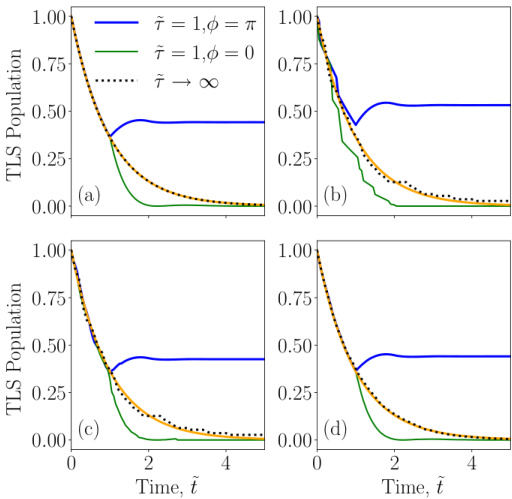{width=40%} FIG. 19. Decay of the TLS population for a single TLS in a waveguide with no feedback (black dashed), and with $\tilde{\tau}=1$ for the constructive case with $\phi=\pi$ (blue) and the destructive one (green). The case with no feedback is compared with the analytical solution (orange). In (a), the MPS method is used, and in (b)-(d) the SDW model is used averaged for 10, 100, and 2000 trajectories respectively. We see excellent agreement with both numbers after about $N_{T}>1000$.

in a waveguide, with and without feedback, the computational run times are compared in Tables I and II. All the examples are run on the same computer workstation (125.6 GB RAM, 3.70 GHz, 16 cores).

In the infinite waveguide case (Table 1), the MPS code is faster than any of the cases given with the SDW. Once the feedback is introduced into the MPS approach, as each time step involves more operations, the MPS code slows down. However, it is still comparable to around 100 trajectories. We note also that the SDW model runs much faster when $\phi = \pi$ because this is the population trapping case and many of the trajectories have no quantum jumps occurring. Thus the precalculated sample trajectory allows all no-jump trajectories to be instantly run which reduces the computation time.

While the MPS approach appears to be faster for the presented examples, they are clearly both efficient, and it

TABLE I. Run times for TLS decay in an infinite waveguide (vacuum dynamics). $\Delta\bar{t}=0.05$, 10 boxes in the SDW code (non parallelized code), and a maximum bond dimension of 2 in the MPS code.

| Model | N T | Run Time (s) |
| --- | --- | --- |
| SDW | 10 | 0.25 |
| 100 | 1.04 |
| 2000 | 14.22 |
| MPS |  | 0.11 |

 ---------------------------------------------[ 第18页 ]---------------------------------------------  

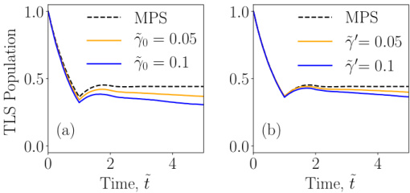{width=40%} FIG. 20. Decay of the TLS population for a single TLS in a waveguide with a constructive feedback ($\tilde{\tau}=1, \varphi=\pi$). In (a), an off-chip decay ($\gamma_0$) is introduced in the SDW model. In (b), a pure dephasing process ($\gamma_0$) is taken in account for the SDW model. In both cases, we see that these additional dissipation processes prevents the case of perfect population trapping, and ultimately the population decays in the long time limit.

is important to note that the computational implementation and intuitive understanding is much more complex. In addition, the SDW model can easily add in additional dissipation processes that are known to be important for connecting to real experiments, including off-chip photon decay and pure dephasing—the latter process is a well known feature with solid state quantum bits (quantum dots) [35,51-59]. As remarked earlier, implementing such processes with MPSs is not well developed and nontrivial. To demonstrate the role of these processes, Fig. 20 shows the behavior of the decay of a TLS in a waveguide with a coherent feedback when these two effects are considered, separately. Indeed, in both cases, we see that these additional dissipation channels break the regime of perfect TLS population trapping, and it is essential to realize that these dephaning processes set a limit on how well one can exploit feedback in general. The run times increase around four times when these effects are added to the system, for the same parameters as the ones shown in Table II with $N_{T} = 2000$; this increase is more than reasonable given the complexity of the open system we are modeling, and the simulations are still efficient, even on a single computer.

It is also interesting to note that the role of $\gamma_{0}$ and $\gamma'$ are qualitatively different in how they affect the trapping condition. This is because the $\gamma_{0}$ process affects both the population decay and the coherence, while the pure dephasing does not directly reduce the population, but instead dephases the coherence that is necessary for population trapping. Thus

TABLE II. Run times for TLS decay in semi-infinite waveguide (vacuum dynamics). $\Delta\tilde{t}=0.05$, 20 boxes in the SDW code (non parallelized code), and a maximum bond dimension of 2 in the MPS code.

| Model | Number of trajectories | Run time (s) |
| --- | --- | --- |
| $\phi = \pi$ | $\phi = 0$ |
|  | 10 | 0.15 | 0.24 |
| SDW | 100 | 0.69 | 1.76 |
|  | 2000 | 12.66 | 33.56 |
| MPS |  | 1.18 | 1.30 |

TABLE III. Run times for a driven TLS with $\tilde{\tau}=2$ and $N_{T}=3000$. We use $\Delta\tilde{t}=0.02$, 100 boxes in the SDW code (non parallelized code), and a maximum bond dimension of 32 in the MPS code.

| Model | Number of photons | Run time (s) |
| --- | --- | --- |
| SDW | 1 | 63.10 |
|  | 2 | 693.89 |
| MPS |  | 43.43 |

the effect of off-chip decay is more problematic, though both processes lead to an overall decay of the trapped state.

# B. Single two-level system in a waveguide with and without a time-delayed feedback: nonlinear dynamics with a coherent pump field

Now that we have studied the vacuum decay dynamics of the TLS population, which can also easily be described with classical linear response theories [94], the real power of our presented waveguide QED methods is in their ability to describe nonlinear effects beyond a single quantum, namely unique quantum nonlinear effects that have no classical counterpart. As an example, one can explicitly include one photon in the feedback loop, and the TLS or/and a side coupled cavity [16], which goes beyond the one quanta limit. Thus we next add a coherent pump field to the system Hamiltonian to access the quantum nonlinear regime.

Note, one of the main advantages of using MPSs is that there is no restriction on the number of photons considered in the waveguide (subject to computational restrictions inherent in the method), while in the SDW model we are restricted to one or two photons in the waveguide for this study; the extension to include three or more photons is possible, but the computational overhead may be considerable. However, it is very insightful to explicitly see the differences between between the one-photon and two-photon results, and often two photons plus the TLS excitations is enough for many few photon descriptions, even under extreme conditions (as we show below).

Figures 21 and 22 show coherent pump examples for the large drive strengths of $\bar{\Omega}=2\pi$ and $\bar{\Omega}=8\pi$, respectively, which easily break a weak excitation approximation (when the TLS is basically in the classical harmonic oscillator regime). First, in Fig. 21, three different feedback lengths are considered for the same drive, yielding feedback times of $\tilde{\tau}=0.25,1,2$. It can be seen that, as the feedback time increases, the results with 1 photon deviate from the MPS model and the two-photon SDW results, and thus becomes incorrect. However, the two-photon case seems to agree well with the MPS model, showing that this approximation is very accurate here. We also highlight that for longer feedback loops, the SDW model becomes slower, especially in the case of the SDW with two photons. Physically, as the length of the feedback loop increases, the probability of having two photons in the waveguide increases as well, making the approach in which two photons are considered more accurate. Table III gives a summary of computational run times for the two models.

 ---------------------------------------------[ 第19页 ]---------------------------------------------  

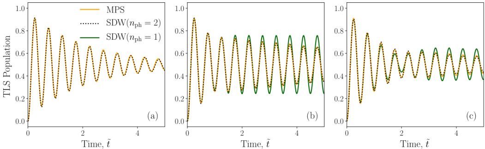{width=83%} FIG. 21. Single TLS driven by a CW pump field with $\tilde{\Omega}=2\pi$. Comparison of the TLS population using MPSs (orange) and the SDW model for one photon in the waveguide (green) and 2 photons in the waveguide (dashed black). Different feedback lengths are presented: (a) $\tilde{r}=0.25$, (b) 1, and (c) 2. All the SDW cases are run for 3000 trajectories.

In Fig. 22, it is important to note that the 1 photon limit case gives perfect population trapping [22,89], while there is no perfect trapping in the two-photon case and the MPS solution, and a decay can be seen. This is expected as it is practically impossible to phase match at two different frequencies, when quantum nonlinearies become important. This multiphoton influence on feedback-induced population trapping is consistent with the results from Grimsmo [22] (whose results were limited to the early transient regime, showing only a few cycles). Note also, when running these codes for a non-trapping situation (e.g., with $\tilde{\Omega}=5$), we found that the breakdown of the one photon case is still important (though suppressed), and the two-photon case again agrees quantitatively well with the MPS result.

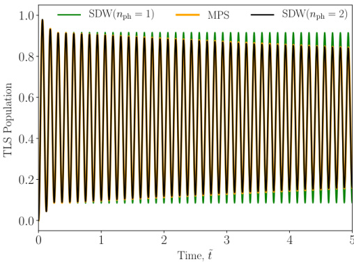{width=40%} FIG. 22. Single TLS driven by a strong CW pump field with $\tilde{\Omega}=8\pi$, and $N_{T}=5000$ in the SDW cases. Comparison between the MPS (orange) and the SDW model for one photon in the waveguide (green) and two photons in the waveguide (black). The evolution of the TLS population shows a good agreement between the two-photon SDW model and the MPS model. However, the 1-photon limit deviates from these two others showing a perfect trapping condition (within numerical precision) [15,22].

In Fig. 22, we now apply an even larger pump field ($\tilde{\Omega}=8\pi$) on the same system. We see again, that even in the very strong field regime, the two-photon SDW model is very accurate (agrees quantitatively well with the MPS results). However, we note the two-photon SDW model needs more trajectories ($N_{T}=5000$) to recover an accurate ensemble average, and a smaller time step in general, causing the SDW code to become somewhat slow and require more computational memory for accurate results; as an example, with a single multicore workstation, in this case, the run time for the SDW is 2406 s (for a time step $\delta\tilde{t}=0.002$) whereas the MPS code only takes 108 s to run. Nevertheless, this is a very difficult nonlinear QO dynamic to model, and most other approaches to this problem would run into simulate computational problems or would not even be tractable (note we are also simulating for relatively long time scales with multiple oscillations). In addition, the longer feedback results are likely not as practical for applications, especially when one considers other realistic scattering processes.

# C. Two coupled two-level systems in a waveguide with a finite delay time between them

Next, we consider two TLSs in a waveguide (see Sec. II C), with a finite separation between them. This example is a good test-best for beginning to exploit many-body interactions beyond the instantaneous coupling limit (an approximation that is frequently made when considering collective effects in the nonlinear regime). It is also a pedagogically important example, since it is known to produce sub-radiant and super-radiant Dicke states [88,95,96], bound states in the regime of ultrastrong waveguide QED [97,98], and cause complex waveguide-mediated phase coupling [99]. For this system, we will again consider both vacuum dynamics and the case with strong optical pumping, as well as investigate the role of pure dephasing.

In Fig. 23, we first show results for the vacuum decay case, assuming the same decay rate for both TLSs (this is not a model restriction in either model). We start with the two TLSs in the excited state [Fig. 23(a)] and show how they decay equally, with a delay time of $\tilde{\tau} = 0.5$. Then, we consider a

 ---------------------------------------------[ 第20页 ]---------------------------------------------  

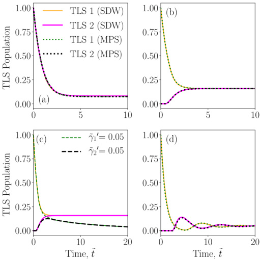{width=40%} FIG. 23. Decay of the TLSs populations for two TLSs in an infinite waveguide, with different spatial separations (delay times). A comparison between both methods is done in the case of (a) both TLSs on the excited state with a feedback of $\tilde{\tau}=0.5$, and (b) one TLS on the excited state and one on the ground state with a feedback of $\tilde{\tau}=0.5$; in (c) we show the same situation as (b) but now also with finite pure dephasing added to the TLSs; the effect of adding $\gamma_0$ (off-chip decay) has a very similar effect for the same decay rate so we do not show it. In (d), one TLS is initialized on the excited state and one on the ground state with $\tilde{\tau}=2.5$. All the SDW cases are run for 1000 trajectories at a two-photon truncation.

different initial condition where one TLS is in the ground state and the other one is in the excited state [Fig. 23(b)]. It can be seen that both TLSs reach an equilibrium with a trapped TLS population, whose value decreases when the feedback time increases [cf. Figs. 23(b) and 23(d)]. Note the significant retardation oscillations that appear for the long delay time, initially causing a faster decay time. This shows that one can use the finite delay as a means to tune the emission dynamics of the distant TLS, similar to the effects of a distant mirror. Indeed, in the weak excitation regime, the other TLS acts a resonant mirror (resonant scatterer), with a bandwidth that depends on the decay rate. Similar effects can be seen for TLSs embedded in cavities that are connected through a waveguide [30]. All of these cases are calculated using MPSs and the SDW model, showing very good agreement for $N_{T} = 1000$. Figure 23(c) shows the impact of a pure dephasing rate in the TLSs for the same conditions as in (b). This is performed using the SDW code and shows how, in the same way as in the 1 TLS case, the population trapping (and entanglement) is destroyed in the long time limit when this effect is considered. The effect of adding an off-chip decay is very similar, so we do not bother showing it, and both effects cause a long time decay that depends on the additional decay rate. Further study in this coupling regime can be done, e.g., by changing the initial conditions and the phase between the TLSs, which would

TABLE IV. Run times for two TLSs in a infinite waveguide. We use $\Delta\tilde{t}=0.05$ in the SDW model and $\Delta\tilde{t}=0.1$ in the MPS model; we also use 10 and 50 boxes, respectively, in the SDW code (parallelized code with 2 photons, single computer), and a maximum bond dimension of 8 in the MPS code. Note that the $\tilde{t}=0.5$ case is run for $\tilde{t}_{\mathrm{max}}=10$, and the $\tilde{\tau}=2.5$ case is run for $\tilde{t}_{\mathrm{max}}=20$. Note also that for the vacuum dynamics, one could use a 1 photon SDW model which would yield significantly faster run times.

| Model | $\tilde{\tau}$ | Run time (s) |
| --- | --- | --- |
| SDW | 0.5 | $6.13 ($\Delta \tilde{t} = 0.05$, $N_T = 1000$)$ |
| MPS |  | $0.70 ($\Delta \tilde{t} = 0.1$, bond = 8)$ |
| SDW | 2.5 | $381.63 ($\Delta \tilde{t} = 0.05$, N_T = 1000$)$ |
| MPS |  | $4.37 ($\Delta \tilde{t} = 0.1$, bond = 8)$ |

allow us to explore the impact on the known sub-radiant and super-radiant Dicke states [44].

In this non-Markovian example, the decay rate of one TLS can exceed the one given by the Dicke superradiance due to field emitted from the other TLS [see also Figs. 23(d)]. This can produce a constructive interference leading to a "supersupradiant" state. In Ref. [88], this is achieved in vacuum. We stress again that the dynamics in vacuum can easily be solved exactly as has been demonstrated in a number of works for coupling TLSs over macroscopic distances [30], where the retardation dynamics are exactly accounted and shown to play a qualitatively important role on two TLS coupling. Indeed, in a weak excitation approximation, it is relatively easy to also model many chains of atoms [95,100], as well as some of our current systems studies in this paper, such as the non-Markovian dynamics of a TLS due to single-photon scattering in a waveguide [20]. While both our approaches here can also recover the super-superradiant state phenomena in vacuum, the main advantage of our QO waveguide approaches presented here is being apply to explore regimes beyond the one quanta regime, as we show below.

With regards to getting the same level of precision in both methods here, we can still use $\Delta\tilde{t}=0.1$ in the MPS approach, but we need to go to $\Delta\tilde{t}=0.05$ in the SDW model to resolve the frequency of quantum jumps at the beginning of the trajectories. By decreasing the step size, the run times are correspondingly increased for the SDW model. Run times are compared in Table IV, where the parallel version of the SDW code is considered (on a single computer). The long feedback case significantly slows down the SDW code, showing in this case the greatest difference between run times. However, the long feedback case is used more as an academic study, since the coherent interactions typically become less pronounced.

We next consider two coupled TLS and a pumping field, with various results shown in Fig. 24. In Fig. 24(a), the case of a pump, $\tilde{\Omega} = 0.5\pi$, with a delay time, $\tilde{\tau} = 0.5$, is shown. This is calculated with both MPS and SDW codes. For the MPS, a bond dimension of 8 is required, taking 7.17s to run. For the SDW model, we need $N_T = 3000$ taking 189 s in its parallelized version (all results for a single computer). It can be seen how the pump in one TLS affects the TLS population

 ---------------------------------------------[ 第21页 ]---------------------------------------------  

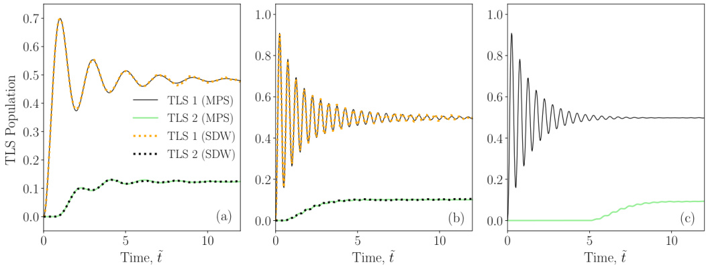{width=83%} FIG. 24. Evolution of the TLS populations for two TLSs in an infinite waveguide, when one of the TLS is driven by a pump field, with different pump strengths and spatial separations (delay times). In all cases, both TLSs start in the ground state, and it is run for 3000 trajectories for the SDW cases. In (a), both the MPS and SDW methods are compared for pump strength of $\tilde{\Omega} = 0.5\pi$ and $\tilde{\tau} = 0.5$. In (b), a stronger pump of $\tilde{\Omega} = 2\pi$ for $\tilde{\tau} = 0.5$ is applied with both methods. Finally, (c) shows a long time delay $\tilde{\tau} = 5$ with $\tilde{\Omega} = 2\pi$ which is solved using MPS.

of the other one, exciting it with a coherent damped coupling and eventually reaching a steady state.

We now consider a stronger driven case in Fig. 24(b). It shows that, if the pump is too strong, an incoherent excitation of the second TLS appears, as the single TLS Rabi drive dominates the coherent oscillation of that population. It can be seen that the first TLS is apparently not affected by the second one, having a similar behavior as in the case of having one driven TLS. The excitation of the second TLS is thus mainly through incoherent excitation.

After confirming the excellent agreement with both methods, we next consider a much longer delay time. In Fig. 24(c), the population results with $\tilde{\tau}=5$ is shown. As we saw in the 1 TLS decay case, when the feedback increases substantially then the SDW code becomes much slower; also, here we have to consider the fact that there is also a significant pump field involved. For these reasons, this last example (c) is only run with the MPS approach. It is shown that for a longer feedback, the pumping scenario is similar to Fig. 24(b), namely, the response of the second TLS to continuous driving is through fluorescence from the first, eventually reaching the same steady state.

# D. Entanglement entropy for two coupled two-level systems in a waveguide: role of retardation

As a final application, we will study the entanglement between the two TLSs, for different delay times. The entanglement between the TLSs (joint system bin) and the waveguide can be measured through the entanglement entropy.

This is the Von Neumann entropy of the reduced density matrix [101] [see also Eq. (40)]. The Von Neumann entropy for a state $\rho$ is

$$
\begin{array}{r} { S ( \rho ) = - \mathrm { T r } ( \rho \log _ { 2 } \rho ) , } \end{array}
$$

which can be rewritten in terms of the Schmidt coefficients,

$$
S ( \rho ) = - \sum _ { \alpha } \Lambda _ { \alpha } ^{2} \log _ { 2 } \Lambda _ { \alpha } ^{2} ,
$$

where $\alpha$ indicates the position of the Schmidt coefficients in the diagonal matrix containing them.

Subsequently, the entanglement entropy between the TLSs bin and the waveguide can be written as follows [10]:

$$
S ( \rho _ { \mathrm { s y s } } ) = - \sum _ { \alpha } \Lambda [ S ] _ { \alpha } ^{2} \log _ { 2 } \left( \Lambda [ S ] _ { \alpha } ^{2} \right) ,
$$

where $\rho_{\mathrm{sys}}$ represents the reduced density matrix of the TLSs bin, and $\Lambda[S]_{\alpha}$ are the Schmidt coefficients corresponding to the TLSs.

Depending on the dimensions of our TLS(s) bin there is a different maximum value of the entanglement entropy as it counts the number of entangled qubits between the parts of the system, being the maximum [101] $S_{\mathrm{max}} = k_{\mathrm{qubits}} \log_2 2$, where $k_{\mathrm{qubits}}$ is the number of qubits. For example, in the case of 1 TLS, the maximum will be 1, and in the case of 2 TLS, the maximum will be 2.

Figure 25 shows the entanglement entropy between the TLSs bin and the waveguide for three different values of feedback ($\tilde{\tau} = 0.5$, $\tilde{\tau} = 1$ and $\tilde{\tau} = 1.5$), where it can be seen that the longer the feedback the lower the entanglement after reaching a steady state. For these examples, we use the MPS approach only, though clearly we would obtain the same result with the SDW approach.

# VI. CONCLUSIONS

We have presented two different models for solving quantum nonlinear light-matter in waveguide-QED systems, using MPSs and a SDW model. Both approaches are shown to efficiently describe the complicated non-Markovian cases of a time-delayed coherent feedback and two spatially separated TLSs. We applied these models to study three different

 ---------------------------------------------[ 第22页 ]---------------------------------------------  

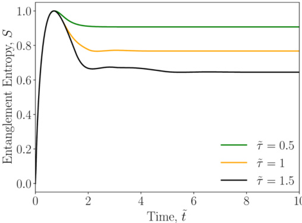{width=40%} FIG. 25. MPS calculation of the entanglement entropy between the TLSs bin and the waveguide [Eq. (102)], for the decay 2 TLSs given different feedback: $\tilde{\tau} = 0.5$ (green), 1 (orange), and 1.5 (black). In the three example cases, one TLS starts on the excited state and the other TLS starts on the ground state.

topical systems in waveguide quantum circuits, including a TLS coupled to an infinite waveguide, a TLS coupled to a semi-infinite waveguide (with a time-delayed feedback), and two spatially separated TLS coupled to an infinite waveguide. Both methods include waveguide photons that are quantized at the system level and, importantly, can explore both linear and nonlinear quantum regimes. While the MPS approach is intrinsically non-Markovian, the SDW model solves Markovian equations of motion and exploits QT theory which also provides physical insight into the underlying stochastic dynamics [23].

After presenting the theory of MPSs and the SDW model, results were shown and compared directly for the three QED-waveguide systems of interest. Numerically, we find excellent agreement between both methods if the required number of waveguide photons is included in the SDW model, which works remarkably well with up to two photons in the loop, even under extreme pumping conditions. The SDW model also allows us to easily identify the differences between a one photon and a two photon approximation, yielding information about the role of two photon interference effects. For the case of one TLS and a time-delayed feedback, we have studied both the vacuum dynamics and nonlinear dynamics, verifying that the one-photon-in-the loop approximation breaks down in the presence of a strong pumping field. We also showed how both methods can efficiently track the population trapped state, easily yielding coherent oscillations over a large number of periods. In addition, it was shown how two spatially separated TLSs can be efficiently modelled with both approaches, showing again the vacuum dynamics and nonlinear quantum dynamics with a coherent pump field. We investigated the role of retardation, and briefly discussed how to quantify the entanglement entropy between the

TLSs and the waveguide, with various delay times (spatial separations).

While we have shown that both approaches offer excellent complimentary information for modeling system-level waveguide QED, each has certain advantages and disadvantages for studying waveguide QED systems. The MPS model, although significantly more complicated to implement, offers faster run-time results in most of the cases studied in our paper, for the same level of precision. This becomes more noticeable when we increase the feedback length or/and if the system is driven by a very strong pump field. In these cases, the SDW model can run into computational memory problems; in contrast, in the MPS case, although the run times increase, there are no memory problems found for the examples presented. On the other hand, smaller delay times are more practical anyway. The SDW model also has some notable advantages over MPSs: (i) it can show results for different levels of approximation more clearly, such as results with one photon or two photons in the loop; (ii) it is far easier to implement computationally, is perfectly parallelizable, and uses well known techniques in quantum optics, such as QT theory; (iii) the equations are actually all Markovian, even though retardation effects are fully accounted for; and (iv) the ease of adding in other dissipation channels such as off-chip decay and pure dephasing is fairly straightforward. In this latter case, we demonstrated the importance of these effects as an important limit to creating population trapped states and entangled qubits. For connecting to real experiments, such as with semiconductor quantum dots, including such processes is critical.

Overall, our paper shows how one can implement both these two different methods to accurately model complicated waveguide QED systems, which can work together as powerful and complementary models in quantum optics. Indeed, as we have demonstrated, these methods can be used to improve our understanding and exploitation of complex non-Markovian feedback systems. Both the SDW and the MPS models can also support the addition of more complicated circuits, including two TLSs with a mirror-based coherent feedback, pulsed excitation, and input-output theory with input photon states. Although we find that the approximation to two photons is highly accurate for the results presented in this paper, the presence of more photons can become important in other cases, giving the opportunity to describe more complex systems in future work, e.g., three quantum emitters (TLSs) in a waveguide [102] (where the side atoms can behave like mirrors in cavity QED [103]), a higher number of qubits [104,105], and 1D atomic arrays [106,107].

# ACKNOWLEDGMENTS

This work was funded by the Natural Sciences and Engineering Research Council of Canada, the Canadian Foundation for Innovation and Queen's University, Canada. Howard Carmichael acknowledges the support of the New Zealand Tertiary Education Committee through the Dodd-Walls Centre for Photonic and Quantum Technologies. We thank Nir Rotenberg for useful comments.

 ---------------------------------------------[ 第23页 ]---------------------------------------------  

[1] S. Hughes, Enhanced single-photon emission from quantum dots in photonic crystal waveguides and nanocavities, Opt. Lett. 29, 2659 (2004).

[2] J.-T. Shen and S. Fan, Strongly correlated multiparticle transport in one dimension through a quantum impurity, Phys. Rev. A 76, 062709 (2007).

[3] J.-T. Shen and S. Fan, Strongly Correlated Two-Photon Transport in a One-Dimensional Waveguide Coupled to a Two-Level System, Phys. Rev. Lett. 98, 153003 (2007).

[4] H. Zheng, D. J. Gauthier, and H. U. Baranger, Waveguide QED: Many-body bound-state effects in coherent and fock-state scattering from a two-level system, Phys. Rev. A 82, 063816 (2010).

[5] D. Witthaut and A. S. Sørensen, Photon scattering by a three-level emitter in a one-dimensional waveguide, New J. Phys. 12, 043052 (2010).

[6] P. Longo, P. Schmitteckert, and K. Busch, Few-photon transport in low-dimensional systems, Phys. Rev. A 83, 063828 (2011).

[7] D. Roy, Two-Photon Scattering by a Driven Three-Level Emitter in a One-Dimensional Waveguide and Electromagnetically Induced Transparency, Phys. Rev. Lett. 106, 053601 (2011).

[8] E. Sanchez-Burillo, D. Zueco, J. J. Garcia-Ripoll, and L. Martin-Moreno, Scattering in the Ultrastrong Regime: Non-linear Optics with One Photon, Phys. Rev. Lett. 113, 263604 (2014).

[9] G. Calajó, F. Ciccarello, D. Chang, and P. Räbl, Atom-field dressed states in slow-light waveguide QED, Phys. Rev. A 93, 033833 (2016).

[10] H. Pichler and P. Zoller, Photonic Circuits with Time Delays and Quantum Feedback, Phys. Rev. Lett. 116, 093601 (2016).

[11] V. S. C. Manga Rao and S. Hughes, Single quantum-dot Purcell factor and $\beta$ factor in a photonic crystal waveguide, Phys. Rev. B 75, 205437 (2007).

[12] T. Lund-Hansen, S. Stobbe, B. Julsgaard, H. Thyrestrup, T. Sünner, M. Kamp, A. Forchel, and P. Lodahl, Experimental Realization of Highly Efficient Broadband Coupling of Single Quantum Dots to a Photonic Crystal Waveguide, Phys. Rev. Lett. 101, 113903 (2008).

[13] A. Laucht, S. Pütz, T. Günther, N. Hauke, R. Saive, S. Frédérick, M. Bichler, M.-C. Amann, A. W. Holleitner, M. Kaniber, and J. J. Finley, A Waveguide-Coupled On-Chip Single-Photon Source, Phys. Rev. X 2, 011014 (2012).

[14] C. W. Gardiner and P. Zoller, Quantum Noise: A Handbook of Markovian and non-Markovian Quantum Stochastic Methods with Applications to Quantum Optics (Springer, Berlin, 2010).

[15] L. Droenner, N. L. Naumann, E. Schöll, A. Knorr, and A. Carmele, Quantum Pyragas control: Selective control of individual photon probabilities, Phys. Rev. A 99, 023840 (2019).

[16] G. Crowder, H. Carmichael, and S. Hughes, Quantum trajectory theory of few-photon cavity-QED systems with a time-delayed coherent feedback, Phys. Rev. A 101, 023807 (2020).

[17] U. Dorner and P. Zoller, Laser-driven atoms in half-cavities, Phys. Rev. A 66, 023816 (2002).

[18] T. Tufarelli, F. Ciccarello, and M. S. Kim, Dynamics of spontaneous emission in a single-end photonic waveguide, Phys. Rev. A 87, 013820 (2013).

[19] A. Carmele, J. Kabuss, F. Schulze, S. Reitzenstein, and A. Knorr, Single Photon Delayed Feedback: A Way to Stabilize

Intrinsic Quantum Cavity Electrodynamics, Phys. Rev. Lett. 110, 013601 (2013).

[20] Y.-L. L. Fang, F. Ciccarello, and H. U. Baranger, Non-Markovian dynamics of a qubit due to single-photon scattering in a waveguide, New J. Phys. 20, 043035 (2018).

[21] N. Német, A. Carmele, S. Parkins, and A. Knorr, Comparison between continuous- and discrete-mode coherent feedback for the Jaynes-Cummings model, Phys. Rev. A 100, 023805 (2019).

[22] A. L. Grimsmo, Time-Delayed Quantum Feedback Control, Phys. Rev. Lett. 115, 060402 (2015).

[23] S. J. Whalen, A. L. Grimsmo, and H. J. Carmichael, Open quantum systems with delayed coherent feedback, Quantum Sci. Technol. 2, 044008 (2017).

[24] H. Chalabi and E. Waks, Interaction of photons with a coupled atom-cavity system through a bidirectional time-delayed feedback, Phys. Rev. A 98, 063832 (2018).

[25] A. Kubanek, M. Koch, C. Sames, A. Ourjoumtsev, P. W. H. Pinkse, K. Murr, and G. Rempe, Photon-by-photon feedback control of a single-atom trajectory, Nature (London) 462, 898 (2009).

[26] G. G. Gillett, R. B. Dalton, B. P. Lanyon, M. P. Almeida, M. Barbieri, G. J. Pryde, J. L. O'Brien, K. J. Resch, S. D. Bartlett, and A. G. White, Experimental Feedback Control of Quantum Systems Using Weak Measurements, Phys. Rev. Lett. 104, 080503 (2010).

[27] T. Brandes, Feedback Control of Quantum Transport, Phys. Rev. Lett. 105, 060602 (2010).

[28] A. Balouchi and K. Jacobs, Coherent versus measurement-based feedback for controlling a single qubit, Quantum Sci. Technol. 2, 025001 (2017).

[29] G. Calajó, Y.-L. L. Fang, H. U. Baranger, and F. Ciccarello, Exciting a Bound State in the Continuum through Multiphoton Scattering Plus Delayed Quantum Feedback, Phys. Rev. Lett. 122, 073601 (2019).

[30] P. Yao and S. Hughes, Macroscopic entanglement and violation of Bell's inequalities between two spatially separated quantum dots in a planar photonic crystal system, Opt. Express 17, 11505 (2009).

[31] S. M. Hein, A. Carmele, and A. Knorr, Creation and control of entanglement by time-delayed quantum-coherent feedback, in Physics and Simulation of Optoelectronic Devices XXIV, edited by B. Witzigmann, M. Osinski, and Y. Arakawa (SPIE, 2016).

[32] S. Buckley, K. Rivoire, and J. Vučović, Engineered quantum dot single-photon sources, Rep. Prog. Phys. 75, 126503 (2012).

[33] C. Matthiessen, A. N. Vamivakas, and M. Atattüre, Subnatural Linewidth Single Photons from a Quantum Dot, Phys. Rev. Lett. 108, 093602 (2012).

[34] D. Heinze, D. Breddermann, A. Zrenner, and S. Schumacher, A quantum dot single-photon source with on-the-fly all-optical polarization control and timed emission, Nat. Commun. 6, 8473 (2015).

[35] P. Türschmann, H. L. Jeannic, S. F. Simonsen, H. R. Haakh, S. Götzinger, V. Sandoghdar, P. Lodahl, and N. Rotenberg, Coherent nonlinear optics of quantum emitters in nanophotonic waveguides, Nanophotonics 8, 1641 (2019).

[36] X. Gu, A. F. Kockum, A. Miranowicz, Y. xi Liu, and F. Nori, Microwave photonics with superconducting quantum circuits, Phys. Rev. 718-719. 1 (2017).

 ---------------------------------------------[ 第24页 ]---------------------------------------------  

[37] A. F. Kockum, G. Johansson, and F. Nori, Decoherence-Free Interaction between Giant Atoms in Waveguide Quantum Electrodynamics. Phys. Rev. Lett. 120, 140404 (2018).

[38] B. Kannan, M. J. Ruckriegel, D. L. Campbell, A. F. Kockum, J. Braumüller, D. K. Kim, M. Kjaergaard, P. Krantz, A. Melville, B. M. Niedzielski, A. Vepsäläinen, R. Winik, J. L. Yoder, F. Nori, T. P. Orlando, S. Gustavsson, and W. D. Oliver, Waveguide quantum electrodynamics with superconducting artificial giant atoms. Nature (London) 583, 775 (2020).

[39] C. Yang, F. C. Binder, V. Narasimhachar, and M. Gu. Matrix Product States for Quantum Stochastic Modeling. Phys. Rev. Lett. 121, 260602 (2018).

[40] L. Vanderstraaten, Tensor Network States and Effective Particles for Low Dimensional Quantum Spin Systems (Springer, Cham, 2017).

[41] N. L. Naumann, S. M. Hein, M. Kraft, A. Knorr, and A. Carmele, Feedback control of photon statistics, in Physics and Simulation of Optoelectronic Devices XXV, Vol. 10098 (International Society for Optics and Photonics, 2017), p. 100980N.

[42] F. Ciccarello, Collision models in quantum optics, QMTR 4, 53 (2017).

[43] S. J. Whalen, Collision model for non-Markovian quantum trajectories, Phys. Rev. A 100, 052113 (2019).

[44] G. Crowder, Quantum trajectory theory of open cavity-QED systems with a time delayed coherent optical feedback, Master's thesis, Queen's University at Kingston, 2020.

[45] D. Cilluffo, A. Carollo, S. Lorenzo, J. A. Gross, G. M. Palma, and F. Ciccarello, Collisional picture of quantum optics with giant emitters, Phys. Rev. Research 2, 043070 (2020).

[46] R. Orús, A practical introduction to tensor networks: Matrix product states and projected entangled pair states, Ann. Phys. 349, 117 (2014).

[47] L. J. Droenner, Out-of-equilibrium dynamics of open quantum many-body systems, Doctoral thesis, Technischen Universität Berlin, 2019.

[48] S. B. Eduardo, One-dimensional few photon scattering: Numerical and analytical techniques, Ph.D. thesis, Prenas de la Universidad de Zaragoza, Zaragoza, 2017.

[49] T. A. Brun, A simple model of quantum trajectories, Am. J. Phys. 70, 719 (2002).

[50] S. Kretschmer, K. Luoma, and W. T. Strunz, Collision model for non-Markovian quantum dynamics. Phys. Rev. A 94, 012106 (2016).

[51] C. Gustin and S. Hughes, Pulsed excitation dynamics in quantum-dot-cavity systems: Limits to optimizing the fidelity of on-demand single-photon sources, Phys. Rev. B 98, 045309 (2018).

[52] J. Iles-Smith, D. P. S. McCutcheon, A. Nazir, and J. Mørk, Phonon scattering inhibits simultaneous near-unity efficiency and indistinguishability in semiconductor single-photon sources, Nat. Photonics 11, 521 (2017).

[53] A. V. Kuhlmann, J. Houel, A. Ludwig, L. Greuter, D. Reuter, A. D. Wieck, M. Poggio, and R. J. Warburton, Charge noise and spin noise in a semiconductor quantum device, Nat. Phys. 9, 570 (2013).

[54] A. J. Ramsay, A. V. Gopal, E. M. Gauger, A. Nazir, B. W. Lovett, A. M. Fox, and M. S. Skolnick, Damping of Exciton Rabi Rotations by Acoustic Phonons in Optically Excited InGaAs/GaAs Quantum Dots, Phys. Rev. Lett. 104, 017402 (2016).

PHYSICAL REVIEW RESEARCH 5, 023050 (2021)

[55] T. Grange, N. Somaschi, C. Antón, L. De Santis, G. Coppola, V. Giesz, A. Lemaître, I. Sagnes, A. Auffèves, and P. Senellart, Reducing Phonon-Induced Decoherence in Solid-State Single-Photon Sources with Cavity Quantum Electrodynamics, Phys. Rev. Lett. 118, 253602 (2017).

[56] P. Lodahl, S. Mahmoodian, and S. Stobbe, Interfacing single photons and single quantum dots with photonic nanostructures, Rev. Mod. Phys. 87, 347 (2015).

[57] A. Vagov, V. M. Axt, and T. Kuhn, Electron-phonon dynamics in optically excited quantum dots: Exact solution for multiple ultrashort laser pulses, Phys. Rev. B 66, 165312 (2002).

[58] J. Förstner, C. Weber, J. Danckwerts, and A. Knorr, Phonon-Assisted Damping of Rabi Oscillations in Semiconductor Quantum Dots, Phys. Rev. Lett. 91, 127401 (2003).

[59] L. Besombes, K. Kheng, L. Marsal, and H. Mariette, Acoustic phonon broadening mechanism in single quantum dot emission. Phys. Rev. B 63, 155307 (2001).

[60] B. le Feber, N. Rotenberg, and L. Kuipers, Nanophotonic control of circular dipole emission, Nat. Commun. 6, 6695 (2015).

[61] A. B. Young, A. C. T. Thijssen, D. M. Beggs, P. Androvitsaneas, L. Kuipers, J. G. Rarity, S. Hughes, and R. Oulton, Polarization Engineering in Photonic Crystal Waveguides for Spin-Photon Entanglers, Phys. Rev. Lett. 115, 153901 (2015).

[62] I. Söllner, S. Mahmoudian, S. L. Hansen, L. Midolo, A. Javadi, G. Kiršanské, T. Pregnolato, H. El-Ella, E. H. Lee, J. D. Song, S. Stobbe, and P. Lodahl, Deterministic photon-emitter coupling in chiral photonic circuits, Nat. Nanotechnol. 10, 775 (2015).

[63] S. Barik, A. Karasahin, C. Flower, T. Cai, H. Miyake, W. DeGottardi, M. Hafezi, and E. Waks, A topological quantum optics interface, Science 359, 666 (2018).

[64] P. Lodahl, S. Mahmoudian, S. Stobbe, A. Rauschenbeutel, P. Schneeweiss, J. Volz, H. Pichler, and P. Zoller, Chiral quantum optics, Nature (London) 541, 473 (2017).

[65] K. Y. Bliokh and F. Nori, Transverse spin of a surface polariton, Phys. Rev. A 85, 061801(R) (2012).

[66] R. J. Coles, D. M. Price, J. E. Dixon, B. Royall, E. Clarke, P. Kok, M. S. Skolnick, A. M. Fox, and M. N. Makhonin, Chirality of nanophotonic waveguide with embedded quantum emitter for unidirectional spin transfer, Nat. Commun. 7, 1183 (2016).

[67] D. Martin-Cano, H. R. Haakh, and N. Rotenberg, Chiral emission into nanophotonic resonators, ACS Photonics 6, 961 (2019).

[68] B. Orazbayev, N. Kaina, and R. Fleury, Chiral Waveguides for Robust Waveguiding at the Deep Subwavelength Scale, Phys. Rev. Appl. 10, 054069 (2018).

[69] J. Petersen, J. Volz, and A. Rauschenbeutel, Chiral nanophotonic waveguide interface based on spin-orbit interaction of light, Science 346, 67 (2014).

[70] P. Yao and S. Hughes, Controlled cavity QED and single-photon emission using a photonic-crystal waveguide cavity system, Phys. Rev. B 80, 165128 (2009).

[71] H. Pichler, S. Choi, P. Zoller, and M. D. Lukin, Universal photonic quantum computation via time-delayed feedback, Proc. Natl. Acad. Sci. USA 114, 11362 (2017).

[72] I. P. McCulloch, From density-matrix renormalization group to matrix product states, I. Stat. Mech (2007) P10014

 ---------------------------------------------[ 第25页 ]---------------------------------------------  

[73] K. Woolfe, Matrix product operator simulations of quantum algorithms, Ph.D. thesis, University of Melbourne, 2015.

[74] U. Schollwöck, The density-matrix renormalization group in the age of matrix product states, Ann. Phys. 326, 96 (2011).

[75] S. Iblisdir, R. Orús, and J. I. Latorre, Matrix product states algorithms and continuous systems, Phys. Rev. B 75, 104305 (2007).

[76] E. Pavarini, E. Koch, and U. Schollwöck, Emergent phenomena in correlated matter: Lecture notes of the Autumn School Correlated Electrons 2013 at Forschungszentrum Jülich, 23–27 September 2013, edited by Institute for Advanced Simulation, Schriften des Forschungszentrum Jülich Reihe Modeling and Simulation No. 3 (Forschungszentrum Jülich, Jülich, 2013).

[77] L. Vanderstraeten, J. Haegeman, and F. Verstraete, Tangent-space methods for uniform matrix product states, SciPost Phys. Lect. Notes, 7 (2019).

[78] C. Hubig, I. P. McCulloch, and U. Schollwöck, Generic construction of efficient matrix product operators, Phys. Rev. B 95, 035129 (2017).

[79] Y. Subaši, L. Cincio, and P. J. Coles, Entanglement spectroscopy with a depth-two quantum circuit, J. Phys. A 52, 044001 (2019).

[80] M. A. Nielsen, C. M. Dawson, J. L. Dodd, A. Gilchrist, D. Mortimer, T. J. Osborne, M. J. Bremner, A. W. Harrow, and A. Hines, Quantum dynamics as a physical resource, Phys. Rev. A 67, 052301 (2003).

[81] Y. B. Band and Y. Avishai, Quantum Mechanics with Applications to Nanotechnology and Information Science, 1st ed. (Academic Press, Amsterdam; New York, 2013).

[82] E. Sánchez-Burillo, J. García-Ripoll, L. Martín-Moreno, and D. Zueco, Nonlinear quantum optics in the (ultra)strong light-matter coupling, Faraday Discuss. 178, 335 (2015).

[83] S. Xu and S. Fan, Generate tensor network state by sequential single-photon scattering in waveguide QED systems, APL Photonics 3, 116102 (2018).

[84] R. N. C. Pfeifer, G. Evenbly, S. Singh, and G. Vidal, NCON: A tensor network contractor for MATLAB, arXiv:1402.0939.

[85] J. Dalibard, Y. Castin, and K. Mølmer, Wave-Function Approach to Dissipative Processes in Quantum Optics, Phys. Rev. Lett. 68, 580 (1992).

[86] L. Tian and H. J. Carmichael, Quantum trajectory simulations of two-state behavior in an optical cavity containing one atom, Phys. Rev. A 46, R6801 (1992).

[87] R. Dum, P. Zoller, and H. Ritsch, Monte Carlo simulation of the atomic master equation for spontaneous emission, Phys. Rev. A 45, 4879 (1992).

[88] K. Sinha, P. Meystre, E. A. Goldschmidt, F. K. Fatemi, S. L. Rolston, and P. Solano, Non-Markovian Collective Emission from Macroscopically Separated Emitters, Phys. Rev. Lett. 124, 043603 (2020).

[89] J. Kabuss, D. O. Krimer, S. Rotter, K. Stannigel, A. Knorr, and A. Carmele, Analytical study of quantum-feedback-enhanced Rabi oscillations, Phys. Rev. A 92, 053801 (2015).

[90] S. John and T. Quang, Spontaneous emission near the edge of a photonic band gap, Phys. Rev. A 50, 1764 (1994).

[91] R. F. Nabiev, P. Yeh, and J. J. Sanchez-Mondragon, Dynamics of the spontaneous emission of an atom into the photon-density-of-states gap: Solvable quantum-electrodynamical model, Phys. Rev. A 47, 3380 (1993).

[92] P. Kristensen, A. F. Koenderink, P. Lodahl, B. Tromborg, and J. Mörk, Fractional decay of quantum dots in real photonic crystals, Opt. Lett. 33, 1557 (2008).

[93] S. Hughes, L. Ramunno, J. F. Young, and J. E. Sipe, Extrinsic Optical Scattering Loss in Photonic Crystal Waveguides: Role of Fabrication Disorder and Photon Group Velocity, Phys. Rev. Lett. 94, 033903 (2005).

[94] S. Hughes, Coupled-Cavity Qed Using Planar Photonic Crystals, Phys. Rev. Lett. 98, 083603 (2007).

[95] F. Dinc and A. M. Brańczyk, Non-Markovian super-superradiance in a linear chain of up to 100 qubits, Phys. Rev. Research 1, 032042(R) (2019).

[96] Y.-X. Zhang and K. Mølmer, Theory of Subradiant States of One-Dimensional Two-Level Atom Chain, Phys. Rev. Lett. 122, 203605 (2019).

[97] J. Román-Roche, E. Sánchez-Burillo, and D. Zueco, Bound states in ultrastrong waveguide QED, Phys. Rev. A 102, 023702 (2020).

[98] D. Mukhopadhyay and G. S. Agarwal, Multiple Fano interferences due to waveguide-mediated phase coupling between atoms, Phys. Rev. A 100, 013812 (2019).

[99] M.-T. Cheng, J. Xu, and G. S. Agarwal, Waveguide transport mediated by strong coupling with atoms, Phys. Rev. A 95, 053807 (2017).

[100] G. Angelatos and S. Hughes, Polariton waveguides from a quantum dot chain in a photonic crystal waveguide: An architecture for waveguide quantum electrodynamics, Optica 3, 370 (2016).

[101] M. A. Nielsen and I. L. Chuang, Quantum Computation and Quantum Information (Cambridge University Press, 2009).

[102] A. Carmele, N. Nemet, V. Canela, and S. Parkins, Pronounced non-Markovian features in multiply excited, multiple emitter waveguide QED: Retardation induced anomalous population trapping, Phys. Rev. Research 2, 013238 (2020).

[103] M. Mirhosseini, E. Kim, X. Zhang, A. Sipahigil, P. B. Dieterle, A. J. Keller, A. Asenjo-Garcia, D. E. Chang, and O. Painter, Cavity quantum electrodynamics with atom-like mirrors, Nature (London) 569, 692 (2019).

[104] A. Albrecht, L. Henriet, A. Asenjo-Garcia, P. B. Dieterle, O. Painter, and D. E. Chang, Subradiant states of quantum bits coupled to a one-dimensional waveguide, New J. Phys. 21, 025003 (2019).

[105] R. Finsterhölzl, M. Katzer, A. Knorr, and A. Carmele, Using matrix-product states for open quantum many-body systems: Efficient algorithms for Markovian and non-Markovian time-evolution, Entropy 22, 984 (2020).

[106] S. J. Masson and A. Asenjo-Garcia, Atomic-waveguide quantum electrodynamics, Phys. Rev. Research 2, 043213 (2020).

[107] Z. Wang, T. Jaako, P. Kirton, and P. Rabl, Supercorrelated Radiance in Nonlinear Photonic Waveguides, Phys. Rev. Lett. 124 213601 (2020).